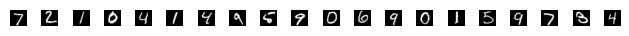

+ MNIST 是經典的手寫數字圖片資料集，已經內建在 tensorflow 裡面，這個資料集可以相當於是深度學習的 "Hello World"，是由美國國家標準與技術研究院(National Institute of Standard and Technology) 所提供。

## 1. 認識 MNIST 資料集
+ 透過 tensorflow 引入資料集
```python
from tensorflow.keras.datasets import mnist

(train_images, train_labels), (test_images, test_labels) = mnist.load_data()
```
+ 查看資料的大小
```python
train_images.shape
len(train_labels)
test_images.shape
test_labels
min(test_labels), max(test_labels)
```

```python
(60000, 28, 28)     # 代表 train_images 是 60000 張 28*28 的圖片 
60000               # 代表 train_labels 同樣也有 60000 份
(10000, 28, 28)     # 代表 test_images 有 10000 張 28*28 的圖片
array([7, 2, 1, ..., 4, 5, 6], dtype=uint8)
(0, 9)              # 代表 test_labels 是 0-9 的數字，資料型別是 uint8
```


## 2. 神經網路架構
+ 接下來的操作流程是：
    1. 將測資 `train_images` 和 `train_labels` 餵給神經網路
    2. 神經網路學習分類圖片，與每張圖片的標籤對比，分類錯誤就修正(學習)
    3. 最後對 `test_images` 進行預測，並驗證結果看是否與 `test_labels` 吻合
```python
from tensorflow import keras
from tensorflow.keras import layers

model = keras.Sequential([
    layers.Dense(512, activation="relu")
    layers.Dense(10, activation="softmax")
])
```
+ 組成神經網路的基本元件為**層(layer)**，一個層就是一個資料處理的模組。可以視之為資料的過濾器。具體而言，每一層都會從資料中萃取出特定的轉換或是表示法(representation)，這些特定的表示法會有助於解決某些問題。大多數深度學習模型會將許多層連接在一起，漸次執行**資料萃取(data distillation)**。
+ 在範例中，神經網路由兩個密集層(Dense layers)緊密連接組成，密集層也稱為**全連接(fully connected)** 神經層。第二個密集層是有 10 個輸出的 softmax 層，最終會輸出 10 個機率評分的陣列，每個評分就是對應到每一個數字的機率。

```python
model.compile(optimizer='adam',
    loss='sparse_categorical_crossentropy',
    metrics=['accuracy'])
```
+ 為了讓神經網路接受訓練，還需要準備三個元件才能進行編譯。
    1. **損失函數(loss function)**: 用來衡量神經網路在訓練資料上的表現，以及引導神經網路往正確的方向修正。
    2. **優化器(optimizer)**: 神經網路根據訓練資料與損失函數值來自行更新權重參數的機制
    3. **評量指標(metrics)**: 最後我們關心的是模型的準確度(accuracy)，即正確的比例。

    \\(
    \boxed{
    \begin{array}{ccccccc}
    && \text{輸入資料 X} & \\\\
    && \downarrow & \\\\
    \red{\boxed{\text{權重'}}} & \rightarrow & \boxed{\text{層(資料轉換)}} \\\\
    \red{\uparrow} && \downarrow & \\\\
    \red{\boxed{\text{權重'}}} & \rightarrow & \boxed{\text{層(資料轉換)}} \\\\
    && \downarrow & \\\\
    \red{\uparrow} && \boxed{\text{預測 Y'}}\rightarrow & \boxed{\text{損失函數}} & \leftarrow & \boxed{\text{標準答案 Y}} \\\\
    &&& \downarrow & \\\\
    \red{\boxed{\text{優化器}}} && \red{\leftarrow}  & \boxed{\text{損失分數}}
    \end{array}
    }
    \\)
```python
train_images = train_images.reshape((60000, 28 * 28))
train_images = train_images.astype('float32') / 255

test_images = test_images.reshape((10000, 28 * 28))
test_images = test_images.astype('float32') / 255
```
+ 再進行訓練之前，需要將資料做正規化處理。在範例中，資料為 [0,255] 之間的像素值(uint8)並儲存在 (60000, 28,28) 的陣列中。我將轉換所有像素資料成 [0,1] 之間的 float32，並儲存在 (60000, 28*28) 的二軸陣列。
```python
model.fit(train_images, train_labels, epochs=5, batch_size=128)
```
+ 接下來就可以呼叫 `fit()` 來訓練模型了。
    + accuracy 代表的是準確度。
    + loss 代表的是損失值，代表使用的損失函數所算出來的評估值。
    ```python
    Epoch 1/5
    469/469 ━━━━━━━━━━━━━━━━━━━━ 6s 10ms/step - accuracy: 0.8717 - loss: 0.4605
    Epoch 2/5
    469/469 ━━━━━━━━━━━━━━━━━━━━ 6s 13ms/step - accuracy: 0.9655 - loss: 0.1179
    Epoch 3/5
    469/469 ━━━━━━━━━━━━━━━━━━━━ 9s 9ms/step - accuracy: 0.9788 - loss: 0.0720
    Epoch 4/5
    469/469 ━━━━━━━━━━━━━━━━━━━━ 6s 12ms/step - accuracy: 0.9857 - loss: 0.0490
    Epoch 5/5
    469/469 ━━━━━━━━━━━━━━━━━━━━ 4s 9ms/step - accuracy: 0.9904 - loss: 0.0354
    <keras.src.callbacks.history.History at 0x7ae172cf8760>
    ```

+ 訓練完，我們接著可以用模型來預測測試資料。
```python
test_digits = test_images[0:20]
predictions = model.predict(test_digits)
predictions.argmax(axis=1)   # 列出每行中最大值的索引值
```

```python
array([7, 2, 1, 0, 4, 1, 4, 9, 5, 9, 0, 6, 9, 0, 1, 5, 9, 7, 3, 4])
```
+ 嘗試把手寫圖片畫出來，比較一下
```python
import matplotlib.pyplot as plt

n = 20
for i in range(n):
plt.subplot(1, n, i+1)
plt.imshow(test_images_pic[i], cmap='gray')
plt.axis('off')

plt.tight_layout()
plt.show()
```


+ 最後我們把模型拿來測試全部 10000 張測資，看一下準確度是多少
```python
test_loss, test_acc = model.evaluate(test_images, test_labels)
print(f'test_acc: {test_acc}')
```

```python
test_acc: 0.9810000061988831
```
+ 代表正確率為 98.1%

+ 比較訓練集的準確度為 0.9904，測試集的準確度為 0.981，這樣的差距稱為**過度配適(overfitting)**，意指模型對新資料的表現比訓練資料還要差。

## 3. 摘要
在本篇做了以下的事
1. 載入 mnist 資料集
2. 用 Dense Layer 建構了一個神經網路
3. 用 model.compile 來編譯神經網路，需要指定 opimizer, loss, metric 三個參數
4. 對資料集做預處理
5. 用 model.fit() 來訓練
6. 用 model.predict() 來預測
7. 用 model.evaluate 來評估模型表現

