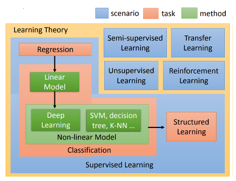

## 目標
+ 機器學習的目標有很多種，參考李宏毅教授的機器學習課程，可以用下面一張圖來概述。

    + Task 代表機器學習的目標
        + Regression: 透過迴歸來預測值。
        + Classification: 處理分類問題。
        + Structed Learning: 生成結構化的資訊(現在稱為生成式 AI, GenAI)
    + Scenario 代表解決問題的策略
        + Supervised Learning: 使用**已標記**的訓練數據進行訓練
        + Semi-supervised Learning: 使用**有標記**與**無標記**的訓練數據進行訓練
        + Unsupervised Learning: 不使用標記的訓練數據進行訓據，由模型自行發現模式與結構
        + Reinforcement Learning: 透過「獎勵」與「懲罰」來學習。
        + Transfer Learning: 將一個任務學習到的知識應用到相關的新任務
    + Method 指應用的方法
        + Linear Model
        + Deep Learning
        + SVM
        + Decision Tree
        + KNN

## 線性迴歸
### 線性代數解法

+ 假如我們學過線性代數，我們想得到它的歸性迴歸方程式，我們的作法會是：
    + 設迴歸方程式為 
        $$\text{y}=\text{wx}+\text{b}\quad\quad (1)$$
    + 我們要求最小平方差
        $$\text{L}=\sum_{i=0}^n(\text{y}_i-\text{y})^2\quad\quad (2)$$
    + 將 (1) 代入 (2)  
        $$\text{L}=\sum_{i=0}^n(\text{y}_i-\text{wx}-\text{b})^2\quad\quad (3)$$  
    + 學過線性代數，我們知道要求極值，可以對其求導數為0，並設 w 與 b 互不為函數，故我們對其個別做偏微分等於0。
        $$\frac{\partial\text{L}}{\partial\text{w}}=0$$

        $$\frac{\partial\text{L}}{\partial\text{b}}=0$$
    + 對 b 做偏微分
        $$\frac{\partial\text{L}}{\partial\text{b}}=-2\sum_{i=0}^n(\text{y}_i-\text{wx}_i-\text{b})=0$$

        $$\sum_{i=0}^n(\text{y}_i-\text{wx}_i-\text{b})=0$$

        $$\sum_{i=0}^n\text{y}_i-\text{w}\sum _{i=0}^n\text{x}_i-\text{nb}=0$$

        $$\text{n}\bar{\text{y}}-\text{n}\bar{\text{wx}}-\text{nb}=0$$

        $$\text{b}=\bar{\text{y}}-\text{w}\bar{\text{x}}\quad\quad (4)$$

        
    + 對 w 做偏微分
        $$\frac{\partial\text{L}}{\partial\text{w}}=-2\sum_{i=0}^n\text{x}_i(\text{y}_i-\text{wx}_i-\text{b})=0$$

        $$\sum_{i=0}^n\text{x}_i(\text{y}_i-\text{wx}_i-\text{b})=0$$

        $$\sum_{i=0}^n\text{x}_i\text{y}_i-\text{w}\sum _{i=0}^n\text{x}_i^2-\text{b}\sum _{i=0}^n\text{x}_i=0$$

        + 代入 (4)

        $$\sum_{i=0}^n\text{x}_i\text{y}_i-\text{w}\sum _{i=0}^n\text{x}_i^2-(\bar{\text{y}}-\text{w}\bar{\text{x}})\sum _{i=0}^n\text{x}_i=0$$

        $$\sum_{i=0}^n\text{x}_i\text{y}_i-\text{w}\sum _{i=0}^n\text{x}_i^2-\bar{\text{y}}\sum _{i=0}^n\\text{x}_i+\text{w}\sum _{i=0}^n\text{x}_i\bar{\text{x}}=0$$

        $$\text{w}(\sum _{i=0}^n\text{x}_i\bar{\text{x}}-\sum _{i=0}^n\text{x}_i^2)=\bar{\text{y}}\sum _{i=0}^n\text{x}_i-\sum _{i=0}^n\text{x}_i\text{y}_i$$

        $$\text{w}(\text{n}\bar{\text{x}}^2-\sum _{i=0}^n\text{x}_i^2)=\text{n}\bar{\text{x}}\bar{\text{y}}-\sum _{i=0}^n\text{x}_i\text{y}_i$$

        $$\text{w}=\frac{\sum\text{x}_i\text{y}_i-\text{n}\bar{\text{x}}\bar{\text{y}}}{\sum\text{x}_i^2-\text{n}\bar{\text{x}}^2}$$

        $$\text{w}=\frac{\sum\text{y}_i(\text{x}_i-\bar{\text{x}})}{\sum\text{x}_i(\text{x}_i-\bar{\text{x}})}$$

        $$\text{w}=\frac{\sum(\text{y}-\bar{\text{y}})(\text{x}-\bar{\text{x}})}{\sum(\text{x}_i-\bar{\text{x}})^2}$$

        $$\text{w}=\frac{S_{XY}}{S_{XX}}\quad\quad(5)$$
    
    + 換言之，我們可以透過 (4) 與 (5) 式直接求得迴歸方程式
        $$\text{y}=\frac{S_{XY}}{S_{XX}}\text{x}+(\bar{\text{y}}-\frac{S_{XY}}{S_{XX}}\bar{\text{x}})$$

        其中 
        
        $$S_{XY}=\sum(\text{x}_i-\bar{\text{x}})(\text{y}_i-\bar{\text{y}})=\sum\text{x}_i\text{y}_i-\text{n}\bar{\text{x}}\bar{\text{y}}$$

        $$S_{XX}=\sum(\text{x}_i-\bar{\text{x}})^2=\sum\text{x}_i^2-\text{n}\bar{\text{x}}^2$$

    + 直接運用於 sample: 
        ```python
        import matplotlib.pyplot as plt

        meanx = data[:, 0].mean()
        meany = data[:, 1].mean()

        sxy = 0.0
        sxx = 0.0

        for i in range(data.shape[0]):
        sxy += (data[i,0] - meanx)*(data[i,1] - meany)
        sxx += (data[i,0] - meanx)**2

        w = sxy/sxx
        b = meany - w*meanx

        plt.figure(figsize=(10, 6))
        plt.scatter(data[:, 0], data[:, 1], alpha=0.5)
        plt.plot(data[:, 0], w*data[:, 0] + b, color='red', label='Regression Line')
        plt.xlabel('Size (ping)')
        plt.ylabel('Total Price (10k)')
        plt.title('House Price versus House Size')
        plt.legend()
        plt.grid(True)

        plt.show()

        print(f"w = {w:.4f}")
        print(f"b = {b:.4f}")
        ```
    
    + `w = 34.9738`
    + `b = 602.5411`
    


### 梯度下降(gradient descent)
+ 但事實上，在機器學習的領域要處理的不一定是上述這種只有兩維的問題，多維的問題會有多個梯度為0的地方，代表我們需要求出全部梯度為0的地方，再逐一代入我們的 loss function，最後找出 loss 最小的一組答案。
+ 再者是，加入 activation function 後的方程式，變得並非上述案例中的容易微分。
```python
import numpy as np
import tensorflow as tf
from tensorflow import keras
import matplotlib.pyplot as plt
from matplotlib import cm

# 1. 資料正規化函數
def normalize_data(data):
    return (data - np.mean(data, axis=0)) / np.std(data, axis=0)

# 2. 建立並訓練模型的函數
def train_linear_regression(x_norm, y_norm, learning_rate=0.01, epochs=10):
    # 建立模型
    model = keras.Sequential([
        keras.layers.Dense(1, input_shape=(1,))
    ])
    
    # 編譯模型
    optimizer = keras.optimizers.SGD(learning_rate=learning_rate)
    model.compile(optimizer=optimizer, loss='mse')
    
    # 用於記錄訓練過程的參數
    history = {'w': [], 'b': [], 'loss': []}
    
    class ParameterHistory(keras.callbacks.Callback):
        def on_epoch_begin(self, epoch, logs=None):
            w = self.model.layers[0].get_weights()[0][0][0]
            b = self.model.layers[0].get_weights()[1][0]
            loss = self.model.evaluate(x_norm, y_norm, verbose=0)
            history['w'].append(w)
            history['b'].append(b)
            history['loss'].append(loss)
            
    # 訓練模型
    parameter_history = ParameterHistory()
    model.fit(x_norm, y_norm, epochs=epochs, verbose=0, callbacks=[parameter_history])
    
    # 記錄最後一次的參數
    w = model.layers[0].get_weights()[0][0][0]
    b = model.layers[0].get_weights()[1][0]
    loss = model.evaluate(x_norm, y_norm, verbose=0)
    history['w'].append(w)
    history['b'].append(b)
    history['loss'].append(loss)
    
    return model, history

# 3. 視覺化函數
def plot_training_process(x_raw, y_raw, x_norm, y_norm, history):
    # 創建圖表
    fig, (ax1, ax2) = plt.subplots(1, 2, figsize=(15, 6))
    
    # 將正規化的係數轉換回原始尺度
    w_raw_history = [w * np.std(y_raw) / np.std(x_raw) for w in history['w']]
    b_raw_history = [(b * np.std(y_raw) + np.mean(y_raw) - 
                     w * np.std(y_raw) * np.mean(x_raw) / np.std(x_raw))
                     for w, b in zip(history['w'], history['b'])]
    
    # Contour plot with raw scale
    margin_w = (max(w_raw_history) - min(w_raw_history)) * 0.5
    margin_b = (max(b_raw_history) - min(b_raw_history)) * 0.5
    w_raw_range = np.linspace(min(w_raw_history)-margin_w, max(w_raw_history)+margin_w, 100)
    b_raw_range = np.linspace(min(b_raw_history)-margin_b, max(b_raw_history)+margin_b, 100)
    W_RAW, B_RAW = np.meshgrid(w_raw_range, b_raw_range)
    Z = np.zeros_like(W_RAW)
    
    # 計算每個點的 MSE（在原始尺度上）
    for i in range(W_RAW.shape[0]):
        for j in range(W_RAW.shape[1]):
            y_pred = W_RAW[i,j] * x_raw + B_RAW[i,j]
            Z[i,j] = np.mean((y_pred - y_raw) ** 2)
    
    CS = ax1.contour(W_RAW, B_RAW, Z, levels=20)
    ax1.clabel(CS, inline=True, fontsize=8)
    ax1.plot(w_raw_history, b_raw_history, 'r.-', label='Training path')
    ax1.set_xlabel('w (原始尺度)')
    ax1.set_ylabel('b (原始尺度)')
    ax1.set_title('Contour Plot with Training Path (原始尺度)')
    ax1.legend()
    
    # Raw data scatter plot with regression lines
    ax2.scatter(x_raw, y_raw, alpha=0.5, label='Raw data')
    ax2.set_ylim(700, 2300)
    
    # 繪製每一輪的回歸線
    x_plot = np.linspace(min(x_raw), max(x_raw), 100)
    colors = cm.rainbow(np.linspace(0, 1, len(w_raw_history)))
    
    for i, (w, b) in enumerate(zip(w_raw_history, b_raw_history)):
        y_plot = w * x_plot + b
        ax2.plot(x_plot, y_plot, color=colors[i], alpha=0.3)
    
    ax2.set_xlabel('Area (坪)')
    ax2.set_ylabel('Price (萬)')
    ax2.set_title('Raw Data with Regression Lines')
    
    plt.tight_layout()
    plt.show()

# 載入數據
data = load_data()
x_raw, y_raw = data[:, 0], data[:, 1]

# 轉換為 TensorFlow 格式
x_raw = x_raw.reshape(-1, 1)
y_raw = y_raw.reshape(-1, 1)

# 正規化數據
x_norm = normalize_data(x_raw)
y_norm = normalize_data(y_raw)

# 訓練模型
model, history = train_linear_regression(x_norm, y_norm)

# 視覺化結果
plot_training_process(x_raw.flatten(), y_raw.flatten(), 
                        x_norm.flatten(), y_norm.flatten(), history)

# 輸出最終結果
final_w = history['w'][-1]
final_b = history['b'][-1]
final_loss = history['loss'][-1]

# 將係數轉換回原始尺度
w_raw = final_w * np.std(y_raw) / np.std(x_raw)
b_raw = (final_b * np.std(y_raw) + np.mean(y_raw) - 
        final_w * np.std(y_raw) * np.mean(x_raw) / np.std(x_raw))

print(f"Final equation: y = {w_raw[0]:.2f}x + {b_raw[0]:.2f}")
print(f"Final normalized loss: {final_loss:.6f}")

```
