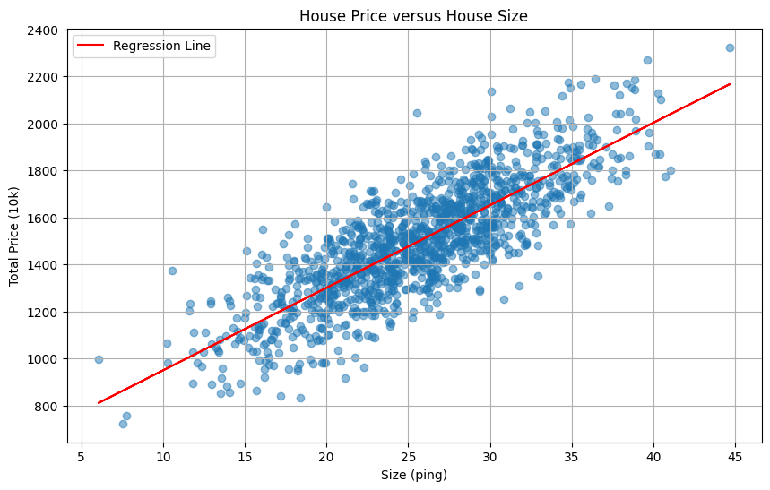
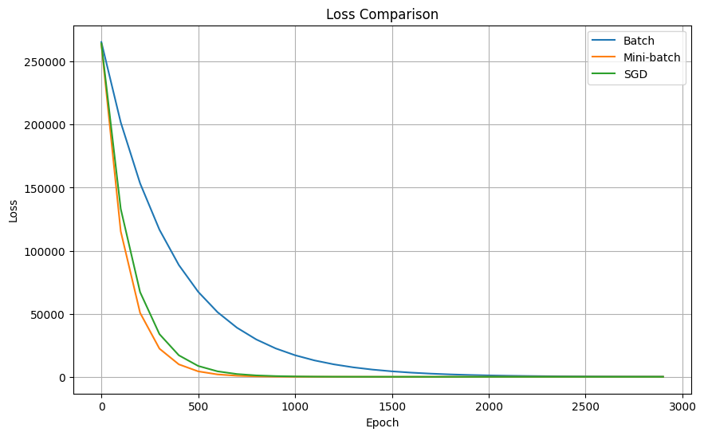

## 目標
+ 機器學習的目標有很多種，參考李宏毅教授的機器學習課程，可以用下面一張圖來概述。

    + Task 代表機器學習的目標
        + Regression: 透過迴歸來預測值。
        + Classification: 處理分類問題。
        + Structed Learning: 生成結構化的資訊(現在稱為生成式 AI, GenAI)
    + Scenario 代表解決問題的策略
        + Supervised Learning: 使用**已標記**的訓練數據進行訓練
        + Semi-supervised Learning: 使用**有標記**與**無標記**的訓練數據進行訓練
        + Unsupervised Learning: 不使用標記的訓練數據進行訓據，由模型自行發現模式與結構
        + Reinforcement Learning: 透過「獎勵」與「懲罰」來學習。
        + Transfer Learning: 將一個任務學習到的知識應用到相關的新任務
    + Method 指應用的方法
        + Linear Model
        + Deep Learning
        + SVM
        + Decision Tree
        + KNN

## 線性迴歸

### 暴力解
+ 假設我們大概知道答案的區間，我們可以暴力求解，將每一個 w, b 代入求最小的 (w, b) 組合
+ 這個方法的缺點是，計算量很大，且我們求值的方式不是連續的，精準度不夠。
```python
import sys

areas = data[:,0]
prices = data[:,1]

def compute_loss(y_pred, y):
  return (y_pred - y)**2

best_w = 0.
best_b = 0.
min_loss = sys.float_info.max

# 猜 w=30-50, step = 0.1
# 猜 b=200-600 step = 1

for i in range(200):
    for j in range(400):
        w = 30 + i*0.1
        b = 200 + j*1
        loss = 0.
        for area, price in zip(areas, prices):
            y_pred = w * area + b
            loss += compute_loss(y_pred, price)
        if loss < min_loss:
            min_loss = loss
            best_w = w
            best_b = b
```
+ `w=35.1`
+ `b=599`


### 線性代數解法
+ 假如我們學過線性代數，我們想得到它的歸性迴歸方程式，我們的作法會是：
    + 設迴歸方程式為 
        $$\text{y}=\text{wx}+\text{b}\quad\quad (1)$$
    + 我們要求最小平方差
        $$\text{L}=\sum_{i=0}^n(\text{y}_i-\text{y})^2\quad\quad (2)$$
    + 將 (1) 代入 (2)  
        $$\text{L}=\sum_{i=0}^n(\text{y}_i-\text{wx}-\text{b})^2\quad\quad (3)$$  
    + 學過線性代數，我們知道要求極值，可以對其求導數為0，並設 w 與 b 互不為函數，故我們對其個別做偏微分等於0。
        $$\frac{\partial\text{L}}{\partial\text{w}}=0$$

        $$\frac{\partial\text{L}}{\partial\text{b}}=0$$
    + 對 b 做偏微分
        $$\frac{\partial\text{L}}{\partial\text{b}}=-2\sum_{i=0}^n(\text{y}_i-\text{wx}_i-\text{b})=0$$

        $$\sum_{i=0}^n(\text{y}_i-\text{wx}_i-\text{b})=0$$

        $$\sum_{i=0}^n\text{y}_i-\text{w}\sum _{i=0}^n\text{x}_i-\text{nb}=0$$

        $$\text{n}\bar{\text{y}}-\text{n}\bar{\text{wx}}-\text{nb}=0$$

        $$\text{b}=\bar{\text{y}}-\text{w}\bar{\text{x}}\quad\quad (4)$$

        
    + 對 w 做偏微分
        $$\frac{\partial\text{L}}{\partial\text{w}}=-2\sum_{i=0}^n\text{x}_i(\text{y}_i-\text{wx}_i-\text{b})=0$$

        $$\sum_{i=0}^n\text{x}_i(\text{y}_i-\text{wx}_i-\text{b})=0$$

        $$\sum_{i=0}^n\text{x}_i\text{y}_i-\text{w}\sum _{i=0}^n\text{x}_i^2-\text{b}\sum _{i=0}^n\text{x}_i=0$$

        + 代入 (4)

        $$\sum_{i=0}^n\text{x}_i\text{y}_i-\text{w}\sum _{i=0}^n\text{x}_i^2-(\bar{\text{y}}-\text{w}\bar{\text{x}})\sum _{i=0}^n\text{x}_i=0$$

        $$\sum_{i=0}^n\text{x}_i\text{y}_i-\text{w}\sum _{i=0}^n\text{x}_i^2-\bar{\text{y}}\sum _{i=0}^n\\text{x}_i+\text{w}\sum _{i=0}^n\text{x}_i\bar{\text{x}}=0$$

        $$\text{w}(\sum _{i=0}^n\text{x}_i\bar{\text{x}}-\sum _{i=0}^n\text{x}_i^2)=\bar{\text{y}}\sum _{i=0}^n\text{x}_i-\sum _{i=0}^n\text{x}_i\text{y}_i$$

        $$\text{w}(\text{n}\bar{\text{x}}^2-\sum _{i=0}^n\text{x}_i^2)=\text{n}\bar{\text{x}}\bar{\text{y}}-\sum _{i=0}^n\text{x}_i\text{y}_i$$

        $$\text{w}=\frac{\sum\text{x}_i\text{y}_i-\text{n}\bar{\text{x}}\bar{\text{y}}}{\sum\text{x}_i^2-\text{n}\bar{\text{x}}^2}$$

        $$\text{w}=\frac{\sum\text{y}_i(\text{x}_i-\bar{\text{x}})}{\sum\text{x}_i(\text{x}_i-\bar{\text{x}})}$$

        $$\text{w}=\frac{\sum(\text{y}-\bar{\text{y}})(\text{x}-\bar{\text{x}})}{\sum(\text{x}_i-\bar{\text{x}})^2}$$

        $$\text{w}=\frac{S_{XY}}{S_{XX}}\quad\quad(5)$$
    
    + 換言之，我們可以透過 (4) 與 (5) 式直接求得迴歸方程式
        $$\text{y}=\frac{S_{XY}}{S_{XX}}\text{x}+(\bar{\text{y}}-\frac{S_{XY}}{S_{XX}}\bar{\text{x}})$$

        其中 
        
        $$S_{XY}=\sum(\text{x}_i-\bar{\text{x}})(\text{y}_i-\bar{\text{y}})=\sum\text{x}_i\text{y}_i-\text{n}\bar{\text{x}}\bar{\text{y}}$$

        $$S_{XX}=\sum(\text{x}_i-\bar{\text{x}})^2=\sum\text{x}_i^2-\text{n}\bar{\text{x}}^2$$

    + 直接運用於 sample: 
        ```python
        import matplotlib.pyplot as plt

        meanx = data[:, 0].mean()
        meany = data[:, 1].mean()

        sxy = 0.0
        sxx = 0.0

        for i in range(data.shape[0]):
        sxy += (data[i,0] - meanx)*(data[i,1] - meany)
        sxx += (data[i,0] - meanx)**2

        w = sxy/sxx
        b = meany - w*meanx

        plt.figure(figsize=(10, 6))
        plt.scatter(data[:, 0], data[:, 1], alpha=0.5)
        plt.plot(data[:, 0], w*data[:, 0] + b, color='red', label='Regression Line')
        plt.xlabel('Size (ping)')
        plt.ylabel('Total Price (10k)')
        plt.title('House Price versus House Size')
        plt.legend()
        plt.grid(True)

        plt.show()

        print(f"w = {w:.4f}")
        print(f"b = {b:.4f}")
        ```
    
    + `w = 34.9738`
    + `b = 602.5411`
    


### 梯度下降(gradient descent)
+ 但事實上，在機器學習的領域要處理的不一定是上述這種只有兩維的問題，多維的問題會有多個梯度為0的地方，代表我們需要求出全部梯度為0的地方，再逐一代入我們的 loss function，最後找出 loss 最小的一組答案。
+ 再者是，加入 activation function 後的方程式，變得並非上述案例中的容易微分。
```python
import numpy as np
import tensorflow as tf
from tensorflow import keras
import matplotlib.pyplot as plt
from matplotlib import cm

# 1. 資料正規化函數
def normalize_data(data):
    return (data - np.mean(data, axis=0)) / np.std(data, axis=0)

# 2. 建立並訓練模型的函數
def train_linear_regression(x_norm, y_norm, learning_rate=0.01, epochs=10):
    # 建立模型
    model = keras.Sequential([
        keras.layers.Dense(1, input_shape=(1,))
    ])
    
    # 編譯模型
    optimizer = keras.optimizers.SGD(learning_rate=learning_rate)
    model.compile(optimizer=optimizer, loss='mse')
    
    # 用於記錄訓練過程的參數
    history = {'w': [], 'b': [], 'loss': []}
    
    class ParameterHistory(keras.callbacks.Callback):
        def on_epoch_begin(self, epoch, logs=None):
            w = self.model.layers[0].get_weights()[0][0][0]
            b = self.model.layers[0].get_weights()[1][0]
            loss = self.model.evaluate(x_norm, y_norm, verbose=0)
            history['w'].append(w)
            history['b'].append(b)
            history['loss'].append(loss)
            
    # 訓練模型
    parameter_history = ParameterHistory()
    model.fit(x_norm, y_norm, epochs=epochs, verbose=0, callbacks=[parameter_history])
    
    # 記錄最後一次的參數
    w = model.layers[0].get_weights()[0][0][0]
    b = model.layers[0].get_weights()[1][0]
    loss = model.evaluate(x_norm, y_norm, verbose=0)
    history['w'].append(w)
    history['b'].append(b)
    history['loss'].append(loss)
    
    return model, history

# 3. 視覺化函數
def plot_training_process(x_raw, y_raw, x_norm, y_norm, history):
    # 創建圖表
    fig, (ax1, ax2) = plt.subplots(1, 2, figsize=(15, 6))
    
    # 將正規化的係數轉換回原始尺度
    w_raw_history = [w * np.std(y_raw) / np.std(x_raw) for w in history['w']]
    b_raw_history = [(b * np.std(y_raw) + np.mean(y_raw) - 
                     w * np.std(y_raw) * np.mean(x_raw) / np.std(x_raw))
                     for w, b in zip(history['w'], history['b'])]
    
    # Contour plot with raw scale
    margin_w = (max(w_raw_history) - min(w_raw_history)) * 0.5
    margin_b = (max(b_raw_history) - min(b_raw_history)) * 0.5
    w_raw_range = np.linspace(min(w_raw_history)-margin_w, max(w_raw_history)+margin_w, 100)
    b_raw_range = np.linspace(min(b_raw_history)-margin_b, max(b_raw_history)+margin_b, 100)
    W_RAW, B_RAW = np.meshgrid(w_raw_range, b_raw_range)
    Z = np.zeros_like(W_RAW)
    
    # 計算每個點的 MSE（在原始尺度上）
    for i in range(W_RAW.shape[0]):
        for j in range(W_RAW.shape[1]):
            y_pred = W_RAW[i,j] * x_raw + B_RAW[i,j]
            Z[i,j] = np.mean((y_pred - y_raw) ** 2)
    
    CS = ax1.contour(W_RAW, B_RAW, Z, levels=20)
    ax1.clabel(CS, inline=True, fontsize=8)
    ax1.plot(w_raw_history, b_raw_history, 'r.-', label='Training path')
    ax1.set_xlabel('w (原始尺度)')
    ax1.set_ylabel('b (原始尺度)')
    ax1.set_title('Contour Plot with Training Path (原始尺度)')
    ax1.legend()
    
    # Raw data scatter plot with regression lines
    ax2.scatter(x_raw, y_raw, alpha=0.5, label='Raw data')
    ax2.set_ylim(700, 2300)
    
    # 繪製每一輪的回歸線
    x_plot = np.linspace(min(x_raw), max(x_raw), 100)
    colors = cm.rainbow(np.linspace(0, 1, len(w_raw_history)))
    
    for i, (w, b) in enumerate(zip(w_raw_history, b_raw_history)):
        y_plot = w * x_plot + b
        ax2.plot(x_plot, y_plot, color=colors[i], alpha=0.3)
    
    ax2.set_xlabel('Area (坪)')
    ax2.set_ylabel('Price (萬)')
    ax2.set_title('Raw Data with Regression Lines')
    
    plt.tight_layout()
    plt.show()

# 載入數據
data = load_data()
x_raw, y_raw = data[:, 0], data[:, 1]

# 轉換為 TensorFlow 格式
x_raw = x_raw.reshape(-1, 1)
y_raw = y_raw.reshape(-1, 1)

# 正規化數據
x_norm = normalize_data(x_raw)
y_norm = normalize_data(y_raw)

# 訓練模型
model, history = train_linear_regression(x_norm, y_norm)

# 視覺化結果
plot_training_process(x_raw.flatten(), y_raw.flatten(), 
                        x_norm.flatten(), y_norm.flatten(), history)

# 輸出最終結果
final_w = history['w'][-1]
final_b = history['b'][-1]
final_loss = history['loss'][-1]

# 將係數轉換回原始尺度
w_raw = final_w * np.std(y_raw) / np.std(x_raw)
b_raw = (final_b * np.std(y_raw) + np.mean(y_raw) - 
        final_w * np.std(y_raw) * np.mean(x_raw) / np.std(x_raw))

print(f"Final equation: y = {w_raw[0]:.2f}x + {b_raw[0]:.2f}")
print(f"Final normalized loss: {final_loss:.6f}")

```


### 批次訓練(Batch)的概念
+ 我們可以在不同的時機點來更新 w 與 b，假設我們的訓練次數為 3000，那 epochs 為3000。且樣本數為 1000。
    + 批次訓練(batch training)，代表的是我們總共做 3000 次的更新，每次都是利用全部 1000 筆樣本算出來的 dw 與 db 去做調整。
    + SGD(Stochastic gradient descent)，代表我們做 3000 * 1000 次的更新，每一個樣本計算出 dw 與 db 就立即去調整。
    + 小批次訓練(mini-batch training)則是介於批次訓練與 SGD 之間，假設我們每 200 個樣本做一次更新，實際上會做 3000 * 5 次更新。

```python
import numpy as np
import matplotlib.pyplot as plt

class LinearRegression:
    def __init__(self, learning_rate=0.0000001):
        self.w = 0.0
        self.b = 0.0
        self.lr = learning_rate
        self.loss_history = []
        
    def predict(self, X):
        return self.w * X + self.b
    
    def compute_loss(self, X, y):
        y_pred = self.predict(X)
        return np.mean((y_pred - y) ** 2)
    
    def compute_gradients(self, X, y):
        y_pred = self.predict(X)
        error = y_pred - y
        dw = np.mean(2 * error * X)
        db = np.mean(2 * error)
        return dw, db
    
    def train_batch(self, X, y, epochs=3000):
        """Full batch gradient descent"""
        for epoch in range(epochs):
            # Compute gradients using all data
            dw, db = self.compute_gradients(X, y)
            
            # Update parameters
            self.w -= self.lr * dw
            self.b -= self.lr * db
            
            # Record loss
            if epoch % 100 == 0:
                loss = self.compute_loss(X, y)
                self.loss_history.append(loss)
                print(f"Epoch {epoch}, Loss: {loss:.2f}")
                
    def train_mini_batch(self, X, y, batch_size=2, epochs=3000):
        """Mini-batch gradient descent"""
        n_samples = len(X)
        
        for epoch in range(epochs):
            # Shuffle the data
            indices = np.random.permutation(n_samples)
            X_shuffled = X[indices]
            y_shuffled = y[indices]
            
            # Mini-batch training
            for i in range(0, n_samples, batch_size):
                X_batch = X_shuffled[i:i+batch_size]
                y_batch = y_shuffled[i:i+batch_size]
                
                # Compute gradients using batch data
                dw, db = self.compute_gradients(X_batch, y_batch)
                
                # Update parameters
                self.w -= self.lr * dw
                self.b -= self.lr * db
            
            # Record loss for the whole dataset
            if epoch % 100 == 0:
                loss = self.compute_loss(X, y)
                self.loss_history.append(loss)
                print(f"Epoch {epoch}, Loss: {loss:.2f}")
                
    def train_sgd(self, X, y, epochs=3000):
        """Stochastic gradient descent"""
        n_samples = len(X)
        
        for epoch in range(epochs):
            # Shuffle the data
            indices = np.random.permutation(n_samples)
            X_shuffled = X[indices]
            y_shuffled = y[indices]
            
            # SGD training (batch_size = 1)
            for i in range(n_samples):
                X_sample = X_shuffled[i:i+1]
                y_sample = y_shuffled[i:i+1]
                
                # Compute gradients using single sample
                dw, db = self.compute_gradients(X_sample, y_sample)
                
                # Update parameters
                self.w -= self.lr * dw
                self.b -= self.lr * db
            
            # Record loss for the whole dataset
            if epoch % 100 == 0:
                loss = self.compute_loss(X, y)
                self.loss_history.append(loss)
                print(f"Epoch {epoch}, Loss: {loss:.2f}")

(areas, prices) = load_data()
models = {
    'Batch': LinearRegression(learning_rate=1e-7),
    'Mini-batch': LinearRegression(learning_rate=1e-7),
    'SGD': LinearRegression(learning_rate=5e-8)
}

models['Batch'].train_batch(areas, prices)
models['Mini-batch'].train_mini_batch(areas, prices)
models['SGD'].train_sgd(areas, prices)

plt.figure(figsize=(10, 6))
for name, model in models.items():
    plt.plot(range(0, 3000, 100), model.loss_history, label=name)
plt.xlabel('Epoch')
plt.ylabel('Loss')
plt.title('Loss Comparison')
plt.legend()
plt.grid(True)
plt.show()

for name, model in models.items():
    print(f"\n{name} Results:")
    print(f"w = {model.w:.6f}")
    print(f"b = {model.b:.6f}")
    print(f"Final Loss = {model.loss_histroy[-1]:.2f}")
```
+ 從更新次數來看，SGD 的更新次數 > 小批次訓練 > 批次訓練，SGD 所耗的時間同樣也比小批次訓練與批次訓練長，但實際上 loss 收斂的情形也比較好嗎？
+ 從下圖比較可見，收斂情況最佳的反而是小批次訓練，我們比較三種方法，總結一下成果：

+ 批次訓練 Batch Gradient Descent (BGD)
    + 每次更新使用所有數據
    + 穩定但計算量大
    + 容易找到局部最優解

+ 小批次訓練 Mini-batch Gradient Descent
    + 每次使用一小批數據
    + 平衡了計算效率和更新穩定性
    + 常用於實際應用

+ Stochastic Gradient Descent (SGD)
    + 每次只使用一個樣本
    + 更新頻繁，收斂較快但不穩定
    + 需要較小的學習率

### L1/L2 正則化(L1/L2 Regularization)
+ 在考慮有多個特徵、且帶有 outlier 或雜訊時
+ L1 正則化 (Lasso Regression)
    + Lasso (Least Absolute Shrinkage and Selection Operator)  
    + 定義：在損失函數中加入參數的絕對值項
    $$
    \text{Loss} = \text{MSE} + \lambda \times \sum|w|
    $$
    + 特點：
        - 傾向於產生稀疏解（某些參數會變成0）
        - 適合用於特徵選擇
        - 對異常值較不敏感

+ L2 正則化 (Ridge Regression)
    + 定義：在損失函數中加入參數的平方項
    $$
    \text{Loss} = \text{MSE} + \lambda \times \sum(w^2)
    $$
    + 特點：
        - 傾向於使所有參數值變小但不為0
        - 計算導數較簡單
        - 對共線性（多重共線性）問題有好處

```python
import numpy as np
import matplotlib.pyplot as plt
from sklearn.preprocessing import StandardScaler
from sklearn.model_selection import train_test_split

# 生成合成數據
np.random.seed(42)

def generate_synthetic_data(n_samples=100):
    # 生成基本特徵
    X1 = np.random.normal(0, 1, n_samples)  # 面積
    X2 = np.random.normal(0, 1, n_samples)  # 房齡
    
    # 生成共線性特徵（與面積高度相關的特徵，如房間數）
    X3 = 0.8 * X1 + 0.2 * np.random.normal(0, 1, n_samples)
    
    # 生成噪音特徵（完全無關的特徵）
    X4 = np.random.normal(0, 1, n_samples)
    
    # 組合特徵
    X = np.column_stack([X1, X2, X3, X4])
    
    # 生成目標值（房價）
    # 主要由X1和X2決定，X3有少許影響，X4完全不影響
    y = 3 * X1 + 2 * X2 + 0.5 * X3 + np.random.normal(0, 0.1, n_samples)
    
    return X, y

class RegularizedRegression:
    def __init__(self, reg_type=None, lambda_reg=0.1, learning_rate=0.01):
        self.reg_type = reg_type
        self.lambda_reg = lambda_reg
        self.lr = learning_rate
        self.w = None
        self.loss_history = []
        
    def fit(self, X, y, epochs=1000):
        n_features = X.shape[1]
        self.w = np.zeros(n_features)
        
        for epoch in range(epochs):
            # 預測
            y_pred = np.dot(X, self.w)
            
            # 計算梯度
            gradient = 2/len(y) * np.dot(X.T, (y_pred - y))
            
            # 加入正則化項的梯度
            if self.reg_type == 'l1':
                gradient += self.lambda_reg * np.sign(self.w)
            elif self.reg_type == 'l2':
                gradient += 2 * self.lambda_reg * self.w
                
            # 更新權重
            self.w -= self.lr * gradient
            
            # 記錄損失
            if epoch % 100 == 0:
                loss = np.mean((y_pred - y) ** 2)
                if self.reg_type == 'l1':
                    loss += self.lambda_reg * np.sum(np.abs(self.w))
                elif self.reg_type == 'l2':
                    loss += self.lambda_reg * np.sum(self.w ** 2)
                self.loss_history.append(loss)
    
    def predict(self, X):
        return np.dot(X, self.w)

# 生成數據
X, y = generate_synthetic_data(n_samples=100)

# 分割訓練集和測試集
X_train, X_test, y_train, y_test = train_test_split(X, y, test_size=0.2, random_state=42)

# 標準化特徵
scaler = StandardScaler()
X_train_scaled = scaler.fit_transform(X_train)
X_test_scaled = scaler.transform(X_test)

# 訓練不同的模型
models = {
    'No Regularization': RegularizedRegression(reg_type=None, lambda_reg=0),
    'L1 (Lasso)': RegularizedRegression(reg_type='l1', lambda_reg=0.1),
    'L2 (Ridge)': RegularizedRegression(reg_type='l2', lambda_reg=0.1)
}

# 訓練模型
for name, model in models.items():
    print(f"\nTraining {name}...")
    model.fit(X_train_scaled, y_train)

# 比較特徵權重
feature_names = ['Area', 'Age', 'Rooms', 'Noise']
plt.figure(figsize=(12, 6))
x = np.arange(len(feature_names))
width = 0.25

for i, (name, model) in enumerate(models.items()):
    plt.bar(x + i*width, model.w, width, label=name)

plt.xlabel('Features')
plt.ylabel('Weight')
plt.title('Feature Weights Comparison')
plt.xticks(x + width, feature_names)
plt.legend()
plt.grid(True)
plt.show()

# 比較測試集上的表現
plt.figure(figsize=(12, 6))
for name, model in models.items():
    y_pred = model.predict(X_test_scaled)
    mse = np.mean((y_test - y_pred) ** 2)
    print(f"\n{name} Test MSE: {mse:.4f}")
    plt.scatter(y_test, y_pred, label=f'{name} (MSE: {mse:.4f})')

plt.plot([y_test.min(), y_test.max()], [y_test.min(), y_test.max()], 'k--', lw=2)
plt.xlabel('True Values')
plt.ylabel('Predictions')
plt.title('Prediction vs True Values')
plt.legend()
plt.grid(True)
plt.show()

# 印出每個特徵的權重
print("\nFeature Weights:")
for name, model in models.items():
    print(f"\n{name}:")
    for fname, w in zip(feature_names, model.w):
        print(f"{fname}: {w:.4f}")
```


+ 觀察重點：
    + L1 正則化（Lasso）：
        + 傾向於將不重要的特徵（如 Noise）權重設為 0
        + 在有共線性的特徵中選擇一個（Area vs Rooms）
    + L2 正則化（Ridge）：
        + 所有權重都被縮小
        + 共線性特徵的權重會被平均分配
    + 無正則化：
        + 可能過度擬合噪音
        + 在共線性特徵上表現不穩定
+ 從結果可以看出：
    + L1 正則化確實將無關特徵（Noise）的權重降到接近 0
    + L2 正則化讓所有權重都變得更小，但保持了相對重要性
    + 無正則化的模型權重更大，更容易受噪音影響

+ 主要的差異和實作細節：
    1. **正則化項的加入**
    - L1：在損失函數中加入 `λ * |w|`
    - L2：在損失函數中加入 `λ * w²`

    2. **梯度計算**
    - L1 的梯度：`sign(w) * λ`
    - L2 的梯度：`2 * λ * w`

    3. **超參數 λ (lambda_reg)**
    - 控制正則化的強度
    - 較大的 λ 會產生較小的權重
    - 需要通過交叉驗證來選擇適當的值

    4. **使用場景**
    - L1：特徵選擇，當你認為只有部分特徵是重要的
    - L2：處理共線性，當特徵之間有相關性
