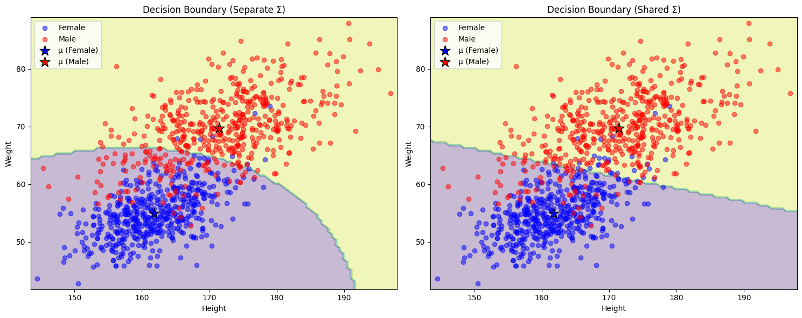

## 貝式定理
+ 假設有一個抽獎箱內有紅球與藍球，球上有標示 A 與 B 類別。
$$
    \begin{array}{|c|c|}
        \\hline
        A&B\\\\\hline
        \blue{\text{●}}\blue{\text{●}}\blue{\text{●}}\red{\text{●}}&\blue{\text{●}}\blue{\text{●}}\red{\text{●}}\red{\text{●}}\red{\text{●}}\red{\text{●}}\\\\\hline
    \end{array}
$$
    + 我們抽到藍球，它是來自於 A 的機率為何，即求 \\(P(A|\blue{\text{●}})\\)？
+ 根據貝式定理：
$$
    P(A|x)=\frac{P(x|A)P(A)}{P(x|A)P(A)+P(x|B)P(B)}
$$
    1. 先驗機率
        + \\(P(A)=\frac{\text{A的球數}}{\text{總球數}}=\frac{4}{10}\\)
        + \\(P(B)=\frac{\text{B的球數}}{\text{總球數}}=\frac{6}{10}\\)
    2. 條件機率
        + \\(P(\blue{\text{●}}|A)=\frac{\text{A中的}\blue{\text{●}}}{\text{A的總球數}}=\frac{3}{4}\\)
        + \\(P(\blue{\text{●}}|B)=\frac{\text{B中的}\blue{\text{●}}}{\text{B的總球數}}=\frac{2}{6}\\)
    套入公式可得
        $$
            P(A|\blue{\text{●}})=\frac{P(\blue{\text{●}}|A)P(A)}{P(\blue{\text{●}}|A)P(A)+P(\blue{\text{●}}|B)P(B)}=\frac{3/4\times4/10}{3/4\times4/10+2/6\times6/10}=\frac{3}{5}
        $$

    + 假設今天猜中類別才能得獎，已經知道是藍球的情況下，來自 A 的機率是 0.6，來自 B 的機率是 0.4，所以我們理論上會選擇 A，因為機率較大。換言之，在機器學習中，我們判斷一個二元分類的問題，我們會將分類判給機率 > 0.5 的那個類別。

## 高斯分布
+ 一維的高斯分分機率密度函數(probability density function, pdf)為：
$$
    f_{\mu,\sigma}(x)=\frac{1}{\sqrt{2\pi\sigma^2}}exp\bigg\lbrace-\frac{(x-\mu)^2}{2\sigma^2}\bigg\rbrace
$$
    + 其中  
        + \\(\mu\\) 為平均數(Mean)，決定分布的中心位置。
        + \\(\sigma\\) 為標準差(Standard Deviation)，決定分布的寬度。
+ 擴展到 n 維向量的多維高斯分布機率密度函數為：
$$
    f_{\mu,\Sigma}(x)=\frac{1}{(2\pi)^{D/2}}\frac{1}{|\Sigma|^{1/2}}exp\bigg\lbrace-\frac{1}{2}(x-\mu)^T\Sigma^{-1}(x-\mu)\bigg\rbrace
$$
    + 其中 x 是一階張量
    $$
        x = \begin{bmatrix} x_1 \\\\ x_2 \\\\ \vdots \\\\ x_n \end{bmatrix}
    $$
    + \\(\mu\\) 代表 x 在每個維度的均值
    $$
        \mu = \begin{bmatrix} \mu_1 \\\\ \mu_2 \\\\ \vdots \\\\ \mu_n \end{bmatrix}
    $$
    + \\(\Sigma\\) 是協方差矩陣，\\(\Sigma\in\mathbb{R}^{n \times n}\\)，表示數據分布的相關性與變異性：
    $$
        \Sigma = \begin{bmatrix}
        \sigma_{11} & \sigma_{12} & \cdots & \sigma_{1n} \\\\
        \sigma_{21} & \sigma_{22} & \cdots & \sigma_{2n} \\\\
        \vdots & \vdots & \ddots & \vdots \\\\
        \sigma_{n1} & \sigma_{n2} & \cdots & \sigma_{nn}
        \end{bmatrix}
    $$
    
    + \\(|\Sigma|\\)是協方差矩陣的行列式，表示協方差矩陣的尺度，用於歸一化分布。

    + \\(\Sigma^{-1}\\)是協方差矩陣的逆矩陣，用於計算標準化的二次型距離。

    + \\((x - \mu)^T \Sigma^{-1} (x - \mu)\\)是馬氏距離（Mahalanobis Distance），表示點 \\(x\\) 與均值 \\(\mu\\) 的加權距離。

## 二元分類
+ 我們嘗試使用高斯分布模型對一個簡單的問題進行描述：
    + 假設我們想用身高、體重來猜測一個人的性別：
    ```python
    class HeightWeightGenerator:
    def __init__(self):
        # 設定男性身高體重的均值和協方差
        self.male_mean = np.array([172, 70])  # [height, weight]
        self.male_cov = np.array([[60, 20],   # height與weight的協方差矩陣
                                 [20, 35]])
        
        # 設定女性身高體重的均值和協方差
        self.female_mean = np.array([162, 55])
        self.female_cov = np.array([[35, 15],
                                  [15, 20]])
        
    def generate_samples(self, n_samples=1000):
        # 生成性別 (0: 女性, 1: 男性)
        genders = np.random.binomial(n=1, p=0.5, size=n_samples)
        
        # 初始化數據陣列
        data = np.zeros((n_samples, 2))
        
        # 生成男性和女性的身高體重數據
        male_indices = genders == 1
        female_indices = genders == 0
        
        # 使用多維高斯分布生成數據
        data[male_indices] = np.random.multivariate_normal(
            self.male_mean, self.male_cov, size=np.sum(male_indices))
        data[female_indices] = np.random.multivariate_normal(
            self.female_mean, self.female_cov, size=np.sum(female_indices))
        
        return data, genders
    ```
    
    + **假設**
        + \\(x = [\text{身高}, \text{體重}]^T \in \mathbb{R}^2\\)：每個數據點的特徵向量。
        + 類別 \\(y \in \{0,要 1\}\\)：性別標籤，0 表示女，1 表示男。
    
    ### 基本假設
    + **高斯分布假設**
        + \\(P(x|y=0) \sim \mathcal{N}(\mu_0, \Sigma_0)\\)：女生特徵的高斯分布。
        + \\(P(x|y=1) \sim \mathcal{N}(\mu_1, \Sigma_1)\\)：男生特徵的高斯分布。

    + **目標**
        + 利用貝氏定理計算 \\(P(y|x)\\)：
        $$
            P(y|x) = \frac{P(x|y)P(y)}{P(x)}
        $$
        + 其中：
            - \\(P(x|y)\\)：由高斯分布表示。
            - \\(P(y)\\)：類別的先驗概率（例如， \\(P(y=1)\\) 和 \\(P(y=0)\\) 可以從訓練數據中估計）。
            - \\(P(x)\\)：由所有類別的加權概率總和給出。

    + **輸出**
        - 使用 \\(P(y=1|x)\\) 作為預測為男的概率，並通過交叉熵損失來進行模型訓練。

    + **代入高斯分布機率密度函數**  
        1. **條件概率 \\(P(y|x)\\)**  
        由於 \\(P(x)\\) 是常數，實際上只需要比較 \\(P(x|y)P(y)\\) 即可：
        $$
            P(y=1|x) = \frac{P(x|y=1)P(y=1)}{P(x|y=1)P(y=1) + P(x|y=0)P(y=0)}
        $$

        將 \\(P(x|y)\\) 展開為高斯分布：
        $$
            P(x|y=k) = \frac{1}{(2\pi)^{n/2} |\Sigma_k|^{1/2}} \exp\left(-\frac{1}{2}(x - \mu_k)^T \Sigma_k^{-1} (x - \mu_k)\right), \quad k \in \{0, 1\}
        $$

        2. **預測概率**
        定義 \\(h(x)\\) 為模型的預測概率：
        $$
            h(x) = P(y=1|x) = f(\mu,\Sigma)
        $$
            + 換言之我們的模型是一個 \\(f(\mu,\Sigma)\\)，以 \\(\mu\\) 與 \\(\Sigma\\) 為參數的模型。

        3. **損失函數**
        使用交叉熵損失(BCE, binary crossentropy)：
        $$
            L = -\frac{1}{m} \sum_{i=1}^m \left[ y_i \log(h(x_i)) + (1 - y_i) \log(1 - h(x_i)) \right],
        $$
        其中：
            - \\(h(x_i)\\)：由高斯分布計算出的 \\(P(y=1|x_i)\\)。
            - \\(y_i\\)：訓練數據的真實標籤。
        ```python
        class GaussianClassifier:
            def __init__(self, shared_sigma=False):
                self.shared_sigma = shared_sigma
                
            def fit(self, X, y, lr=0.01, epochs=100):
                # 初始化參數
                self.mu_0 = np.mean(X[y==0], axis=0)  # class 0 的均值
                self.mu_1 = np.mean(X[y==1], axis=0)  # class 1 的均值
                
                if self.shared_sigma:
                    # 使用共用的協方差矩陣
                    self.sigma = np.cov(X.T)
                else:
                    # 分別計算每個類別的協方差矩陣
                    self.sigma_0 = np.cov(X[y==0].T)
                    self.sigma_1 = np.cov(X[y==1].T)
                
                self.losses = []
                
                # 梯度下降
                for _ in tqdm(range(epochs)):
                    # 計算每個類別的概率
                    if self.shared_sigma:
                        p_0 = multivariate_normal.pdf(X, self.mu_0, self.sigma)
                        p_1 = multivariate_normal.pdf(X, self.mu_1, self.sigma)
                    else:
                        p_0 = multivariate_normal.pdf(X, self.mu_0, self.sigma_0)
                        p_1 = multivariate_normal.pdf(X, self.mu_1, self.sigma_1)
                    
                    # 計算後驗概率
                    p = p_1 / (p_0 + p_1)
                    
                    # 計算BCE損失
                    loss = -np.mean(y * np.log(p + 1e-15) + (1-y) * np.log(1 - p + 1e-15))
                    self.losses.append(loss)
                    
                    # 計算梯度並更新參數
                    for i in range(len(X)):
                        diff_0 = X[i] - self.mu_0
                        diff_1 = X[i] - self.mu_1
                        
                        if self.shared_sigma:
                            inv_sigma = np.linalg.inv(self.sigma)
                            if y[i] == 0:
                                self.mu_0 += lr * inv_sigma.dot(diff_0)
                                self.sigma += lr * (np.outer(diff_0, diff_0).dot(inv_sigma) - inv_sigma)
                            else:
                                self.mu_1 += lr * inv_sigma.dot(diff_1)
                                self.sigma += lr * (np.outer(diff_1, diff_1).dot(inv_sigma) - inv_sigma)
                            
                            # 確保協方差矩陣是正定的
                            self.sigma = (self.sigma + self.sigma.T) / 2
                            eigvals = np.linalg.eigvals(self.sigma)
                            if np.any(eigvals < 0):
                                self.sigma += np.eye(2) * (abs(min(eigvals)) + 1e-6)
                        else:
                            if y[i] == 0:
                                inv_sigma_0 = np.linalg.inv(self.sigma_0)
                                self.mu_0 += lr * inv_sigma_0.dot(diff_0)
                                self.sigma_0 += lr * (np.outer(diff_0, diff_0).dot(inv_sigma_0) - inv_sigma_0)
                                self.sigma_0 = (self.sigma_0 + self.sigma_0.T) / 2
                            else:
                                inv_sigma_1 = np.linalg.inv(self.sigma_1)
                                self.mu_1 += lr * inv_sigma_1.dot(diff_1)
                                self.sigma_1 += lr * (np.outer(diff_1, diff_1).dot(inv_sigma_1) - inv_sigma_1)
                                self.sigma_1 = (self.sigma_1 + self.sigma_1.T) / 2
                                
            def predict(self, X):
                if self.shared_sigma:
                    p_0 = multivariate_normal.pdf(X, self.mu_0, self.sigma)
                    p_1 = multivariate_normal.pdf(X, self.mu_1, self.sigma)
                else:
                    p_0 = multivariate_normal.pdf(X, self.mu_0, self.sigma_0)
                    p_1 = multivariate_normal.pdf(X, self.mu_1, self.sigma_1)
                
                return (p_1 > p_0).astype(int)

        ```
        + 我用了兩個策略，一個是各別計算協方差矩陣(左)，一個是共用協方差矩陣(右)。
        
        + 優缺點：
            + 分離Σ的優勢：
                + 更好地捕捉每個類別的特徵
                + 可以處理類別有不同形狀的情況

            + 共用Σ的優勢：(boundary 會是線性的)
                + 參數更少，不容易過擬合
                + 計算更高效
                + 決策邊界更簡單
        + **摘要：**數據量較小或類別分布相似，建議使用共用Σ的模型；如果數據量大且類別分布差異明顯，可以考慮使用分離Σ的模型。
        
    ### Sigmoid ?
    + 若所有維度都是非相關的，我們可以使用 Naive Bayes Classifier
    + 則後設計率為
    $$
        P(A|x)=\frac{P(x|A)P(A)}{P(x|A)P(A)+P(x|B)P(B)}=\frac{1}{1+\frac{P(x|B)P(B)}{P(x|A)P(A)}}
    $$
    + 令 \\(z=\ln\frac{P(x|A)P(A)}{P(x|B)P(B)}\\)，則
    $$
        P(A|x)=\frac{1}{1+exp(-z)}=\sigma(z)
    $$
    + 哈，是 sigmoid 函式！
    $$
        z=\ln\frac{P(x|A)P(A)}{P(x|B)P(B)}=\ln\frac{P(x|A)}{P(x|B)}+\ln\frac{P(A)}{P(B)}
    $$
    + 後面的這一項，可以從訓練資料得到 \\(\frac{P(A)}{P(B)}=\frac{N_A}{N_B}\\)
    $$
        P(x|A)=\frac{1}{(2\pi)^{D/2}}\frac{1}{|\Sigma_A|^{1/2}}exp\bigg\lbrace{-\frac{1}{2}(x-\mu_A)^T(\Sigma_A)^{-1}(x-\mu_A)}\bigg\rbrace\\\\
        P(x|B)=\frac{1}{(2\pi)^{D/2}}\frac{1}{|\Sigma_B|^{1/2}}exp\bigg\lbrace{-\frac{1}{2}(x-\mu_B)^T(\Sigma_B)^{-1}(x-\mu_B)}\bigg\rbrace
    $$
    $$
        z=\ln\frac{N_A}{N_B}+\frac{\frac{1}{(2\pi)^{D/2}}\frac{1}{|\Sigma_A|^{1/2}}exp\bigg\lbrace{-\frac{1}{2}(x-\mu_A)^T(\Sigma_A)^{-1}(x-\mu_A)}\bigg\rbrace}{\frac{1}{(2\pi)^{D/2}}\frac{1}{|\Sigma_B|^{1/2}}exp\bigg\lbrace{-\frac{1}{2}(x-\mu_B)^T(\Sigma_B)^{-1}(x-\mu_B)}\bigg\rbrace}
    $$
    $$
        z=\ln\frac{N_A}{N_B}+\ln\frac{|\Sigma_B|^{1/2}}{|\Sigma_A|^{1/2}}exp\bigg\lbrace{-\frac{1}{2}[(x-\mu_A)^T(\Sigma_A)^{-1}(x-\mu_A)-(x-\mu_B)^T(\Sigma_B)^{-1}(x-\mu_B)]}\bigg\rbrace
    $$
    $$
        z=(\mu_A-\mu_B)^T\Sigma^{-1}\red{x}-\frac{1}{2}(\mu_A)^T(\Sigma_A)^{-1}\mu_A+\frac{1}{2}(\mu_B)^T(\Sigma_B)^{-1}\mu_B+\ln\frac{N_A}{N_B}
    $$
    + 發現酷東西了：
    $$
        z=w^Tx+b
    $$
    + 將 z 代入原式
    $$
        P(A|x)=\sigma(z)=\sigma(w\cdot x+b)
    $$
    + 換言之，我們透過求 \\(N_A, N_B, \mu_A, \mu_B, \Sigma \\) 可以得到 w, b
    + 那我們是不是可以假設 \\(f(y)=\sigma(wx+b)\\)，直接求 \\(w^* \\)與 \\( b^*\\)

    ### Crossentropy?
    + 百努力分布(Bernoulli Distribution)寫成，其中 k = 0 或 1
    $$
        P(x=k)=p^k\times(1-p)^{(1-k)}
    $$
    + 假設我們的 \\(y\\) 滿足百努力分布，則模型的輸出 \\(\hat{y}\\) 可視為對 p 的估計，我們可以將損失函數寫成
    $$
        L(w,b)=f_{w,b}(x_1)f_{w,b}(x_2)(1-f_{w,b}(x_3))\cdots f_{w,b}(x_n)
    $$
    + 同取 ln
    $$
        \ln L(w,b)=\sum_{i=1}^n [y_i\ln f_{w,b}(x_i)+(1-y_i)\ln(1-f_{w,b}(x_i))]
    $$
    + 為了使其最小化，我們取負號，得到交叉熵損失函數：
    $$
        J(w,b)=-\frac{1}{n}\sum_{i=1}^n [y_i\ln f_{w,b}(x_i)+(1-y_i)\ln(1-f_{w,b}(x_i))]
    $$
    + 其中：
        - \\(y_i\\) 是第 i 個樣本的真實標籤（0或1）
        - \\(f_{w,b}(x_i)\\) 是模型對第 i 個樣本的預測值（介於0和1之間）
        - \\(\frac{1}{n}\\) 是為了取平均