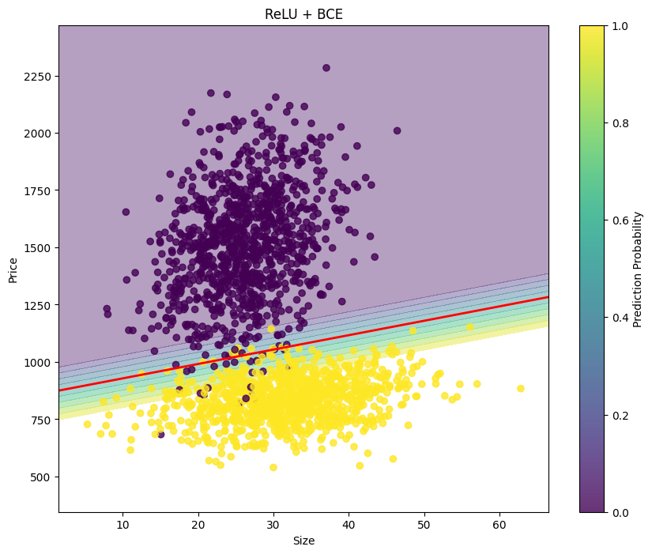

## 命題
我們先嘗試製作一個 sample data，考慮某一個台獨國內的房價與坪數的分布，標記出「城市」與「鄉下」兩個標籤：
+ 紫色代表城市的房子、黃色代表鄉下的房子
+ 城市的房子房價較高且坪數較小、鄉下的房子房價較低且坪數較大。
+ 隱藏的特徵為單位坪數的價格，城市會高於鄉下。

+ 以下是產生的 data，`seed` 設為 `42`
```python
import numpy as np
def load_data(n1=1000,n2=300,seed=42):
  np.random.seed(seed)

  n=n1+n2

  # 城市房屋
  city = np.random.multivariate_normal(
    mean=[25.9, 1503.7],    # [坪數, 總價(萬)]
    cov=[[33.64, 400],      # 坪數標準差 5.8
         [400, 64112.24]],  # 總價標準差 253.2
    size=n
  )

  # 鄉村房屋
  rural = np.random.multivariate_normal(
    mean=[31.8, 834.3],     # [坪數, 總價(萬)]
    cov=[[62.41, 200],      # 坪數標準差 7.9
         [200, 9623.61]],   # 總價標準差 98.1
    size=n
  )

  # 合併資料
  data = np.vstack((city, rural)).astype(np.float32)
  labels = np.vstack((np.zeros((n,1), dtype="float32"),
                      np.ones((n,1), dtype="float32")))
  
  # 打散順序
  shuffle_idx = np.random.permutation(len(data))
  data = data[shuffle_idx]
  labels = labels[shuffle_idx]

  # 分割訓練集和測試集
  train_data = data[:2*n1]
  test_data = data[2*n1:]
  train_labels = labels[:2*n1]
  test_labels = labels[2*n1:]

  return (train_data, train_labels), (test_data, test_labels)

(train_data, train_labels), (test_data, test_labels) = load_data()
```

## 通用函式
+ 因為 price 與 size 之間的值相差較大，所以我定義了正規化的函式、繪圖的函式、training 函式。
```python
import numpy as np
import matplotlib.pyplot as plt
from sklearn.preprocessing import StandardScaler
import tensorflow as tf
from tensorflow.keras import layers, models, callbacks
import pandas as pd

# 共用參數
LEARNING_RATE = 0.01
BATCH_SIZE = 32
EPOCHS = 100
EARLY_STOPPING_PATIENCE = 10

def normalize_data(train_data, test_data):
    """標準化資料"""
    scaler = StandardScaler()
    train_normalized = scaler.fit_transform(train_data)
    test_normalized = scaler.transform(test_data)
    return train_normalized, test_normalized, scaler

def plot_decision_boundary(model, X, y, title, scaler=None, is_extended=False):
    """繪製決策邊界
    
    Parameters:
    -----------
    model : 訓練好的模型
    X : array-like, shape (n_samples, 2) or (n_samples, 3)
        輸入特徵
    y : array-like
        目標變數
    title : str
        圖表標題
    scaler : StandardScaler, optional
        用於還原正規化的scaler
    is_extended : bool
        是否為擴展特徵模型
    """
    if is_extended:
        # 對於擴展特徵模型，只使用前兩個特徵繪圖
        X_plot = X[:, :2]
    else:
        X_plot = X

    # 設定決策邊界的範圍
    x_min, x_max = X_plot[:, 0].min() - 0.5, X_plot[:, 0].max() + 0.5
    y_min, y_max = X_plot[:, 1].min() - 0.5, X_plot[:, 1].max() + 0.5
    
    # 創建網格點
    xx, yy = np.meshgrid(np.arange(x_min, x_max, 0.02),
                        np.arange(y_min, y_max, 0.02))
    
    # 預測網格點的類別
    grid_points = np.c_[xx.ravel(), yy.ravel()]
    
    if is_extended:
        # 為擴展特徵模型添加 price/size ratio
        ratio = grid_points[:, 1:2] / grid_points[:, 0:1]
        grid_points = np.hstack((grid_points, ratio))
    
    Z = model.predict(grid_points)
    Z = Z.reshape(xx.shape)
    
    # 如果提供了scaler，將數據轉換回原始尺度
    if scaler is not None:
        # 轉換網格點
        grid_points_original = scaler.inverse_transform(grid_points[:, :2])
        xx_original = grid_points_original[:, 0].reshape(xx.shape)
        yy_original = grid_points_original[:, 1].reshape(yy.shape)
        
        # 轉換特徵點
        X_original = scaler.inverse_transform(X_plot)
        x_plot = X_original[:, 0]
        y_plot = X_original[:, 1]
        
        xlabel = 'Size'
        ylabel = 'Price'
    else:
        x_plot = X_plot[:, 0]
        y_plot = X_plot[:, 1]
        xx_original = xx
        yy_original = yy
        
        xlabel = 'Normalized Size'
        ylabel = 'Normalized Price'
    
    # 繪製圖形
    plt.figure(figsize=(10, 8))
    
    # 繪製預測機率的漸層
    plt.contourf(xx_original, yy_original, Z, alpha=0.4, levels=np.linspace(0, 1, 11))
    
    # 添加決策邊界（機率=0.5的等高線）
    plt.contour(xx_original, yy_original, Z, levels=[0.5], 
               colors='red', linestyles='-', linewidths=2)
    
    # 繪製資料點
    plt.scatter(x_plot, y_plot, c=y.ravel(), alpha=0.8)
    
    plt.title(title)
    plt.xlabel(xlabel)
    plt.ylabel(ylabel)
    
    # 添加顏色條
    plt.colorbar(label='Prediction Probability')
    plt.show()

def train_and_evaluate(model, train_data, train_labels, test_data, test_labels, 
                      epochs=EPOCHS, batch_size=BATCH_SIZE, use_early_stopping=False):
    """訓練模型並評估"""
    callbacks_list = []
    if use_early_stopping:
        early_stopping = callbacks.EarlyStopping(
            monitor='val_loss',
            patience=EARLY_STOPPING_PATIENCE,
            restore_best_weights=True
        )
        callbacks_list.append(early_stopping)

    history = model.fit(
        train_data, train_labels,
        epochs=epochs,
        batch_size=batch_size,
        validation_split=0.2,
        callbacks=callbacks_list,
        verbose=0
    )
    
    test_loss, test_accuracy = model.evaluate(test_data, test_labels, verbose=0)
    return history, test_loss, test_accuracy
```
## 定義模型
+ 本篇設定了不同的 model, optimizer, loss，不代表哪一種 pattern 的優劣，純粹是示範 library 使用。
+ 由於我想看不同的 optimizer/activation/loss function的差異，所以我共用了部分參數
    + `LEARNING_RATE = 0.01`
    + `BATCH_SIZE = 32`
    + `EPOCHS = 100`
    + `EARLY_STOPPING_PATIENCE = 10`
+ 我列了幾個不同的策略，來看看結果的差異
    1. SGD + 線性模型 (wx+b) + MSE
    2. SGD + Sigmoid 模型 + MSE
    3. SGD + ReLU 模型 + MSE
    4. SGD + Sigmoid 模型 + BCE
    5. Adam + Sigmoid 模型 + BCE
    6. Adam + Sigmoid 模型 + BCE (加入新特徵 price/size)
    7. Adam + 雜複模型 + BCD
    8. Adam + 複雜模型 + BCD  (加入新特徵 price/size)

### 1. SGD + 線性模型 (wx+b) + MSE
```python
# 1. 線性模型 (wx+b)
def create_linear_model():
    model = models.Sequential([
        layers.Dense(1, input_shape=(2,), activation='linear')
    ])
    model.compile(optimizer=tf.keras.optimizers.SGD(learning_rate=LEARNING_RATE),
                 loss='mse',
                 metrics=['accuracy'])
    return model
```

### 2. SGD + Sigmoid + MSE
```python
# 2. Sigmoid模型
def create_sigmoid_model():
    model = models.Sequential([
        layers.Dense(1, input_shape=(2,), activation='sigmoid')
    ])
    model.compile(optimizer=tf.keras.optimizers.SGD(learning_rate=LEARNING_RATE),
                 loss='mse',
                 metrics=['accuracy'])
    return model
```

### 3. SGD + ReLU + MSE
```python
# 3. ReLU模型 + MSE
def create_relu_mse_model():
    model = models.Sequential([
        layers.Dense(1, input_shape=(2,), activation='relu')
    ])
    model.compile(optimizer=tf.keras.optimizers.SGD(learning_rate=LEARNING_RATE),
                 loss='mse',
                 metrics=['accuracy'])
    return model
```

### 4. SGD + ReLU + BCE
```python
# 4. ReLU模型 + BCE
def create_relu_bce_model():
    model = models.Sequential([
        layers.Dense(1, input_shape=(2,), activation='relu')
    ])
    model.compile(optimizer=tf.keras.optimizers.SGD(learning_rate=LEARNING_RATE),
                 loss='binary_crossentropy',
                 metrics=['accuracy'])
    return model
```

### 5. Adam + Sigmoid + BCE
```python
# 5. Adam + BCE
def create_adam_model():
    model = models.Sequential([
        layers.Dense(1, input_shape=(2,), activation='sigmoid')
    ])
    model.compile(optimizer='adam',
                 loss='binary_crossentropy',
                 metrics=['accuracy'])
    return model
```

### 6. Adam + Sigmoid + BCE (加入新特徵)
```python
# 6. 新增 price/size feature 的模型
def add_price_size_ratio(data):
    price_size_ratio = data[:, 1:2] / data[:, 0:1]
    return np.hstack((data, price_size_ratio))

def create_extended_model():
    model = models.Sequential([
        layers.Dense(1, input_shape=(3,), activation='sigmoid')
    ])
    model.compile(optimizer='adam',
                 loss='binary_crossentropy',
                 metrics=['accuracy'])
    return model
```

### 7. Adam + 複雜模型 + Dropout + Early Stop
```python
# 7. 複雜模型 + Dropout
def create_complex_model(input_shape):
    model = models.Sequential([
        layers.Dense(64, input_shape=input_shape, activation='relu'),
        layers.Dropout(0.3),
        layers.Dense(32, activation='relu'),
        layers.Dropout(0.2),
        layers.Dense(16, activation='relu'),
        layers.Dense(1, activation='sigmoid')
    ])
    model.compile(optimizer='adam',
                 loss='binary_crossentropy',
                 metrics=['accuracy'])
    return model
```

### 8. Adam + 複雜模型 + Dropout + Early Stop (加入新特徵)


## 執行
```python
def main():
    # 載入資料
    (train_data, train_labels), (test_data, test_labels) = load_data()
    
    # 標準化資料
    train_normalized, test_normalized, scaler = normalize_data(train_data, test_data)
    
    # 儲存結果的列表
    results = []
    
    # 1. 線性模型
    model1 = create_linear_model()
    history1, test_loss1, test_acc1 = train_and_evaluate(
        model1, train_normalized, train_labels, test_normalized, test_labels)
    plot_decision_boundary(model1, train_normalized, train_labels, 'Linear Model (wx+b)', scaler)
    results.append(('Linear Model', test_acc1))
    
    # 2. Sigmoid模型
    model2 = create_sigmoid_model()
    history2, test_loss2, test_acc2 = train_and_evaluate(
        model2, train_normalized, train_labels, test_normalized, test_labels)
    plot_decision_boundary(model2, train_normalized, train_labels, 'Sigmoid Model', scaler)
    results.append(('Sigmoid Model', test_acc2))
    
    # 3. ReLU + MSE
    model3 = create_relu_mse_model()
    history3, test_loss3, test_acc3 = train_and_evaluate(
        model3, train_normalized, train_labels, test_normalized, test_labels)
    plot_decision_boundary(model3, train_normalized, train_labels, 'ReLU + MSE', scaler)
    results.append(('ReLU + MSE', test_acc3))
    
    # 4. ReLU + BCE
    model4 = create_relu_bce_model()
    history4, test_loss4, test_acc4 = train_and_evaluate(
        model4, train_normalized, train_labels, test_normalized, test_labels)
    plot_decision_boundary(model4, train_normalized, train_labels, 'ReLU + BCE', scaler)
    results.append(('ReLU + BCE', test_acc4))
    
    # 5. Adam + BCE
    model5 = create_adam_model()
    history5, test_loss5, test_acc5 = train_and_evaluate(
        model5, train_normalized, train_labels, test_normalized, test_labels)
    plot_decision_boundary(model5, train_normalized, train_labels, 'Adam + BCE', scaler)
    results.append(('Adam + BCE', test_acc5))
    
    # 6. 加入 price/size ratio
    train_extended = add_price_size_ratio(train_normalized)
    test_extended = add_price_size_ratio(test_normalized)
    
    model6 = create_extended_model()
    history6, test_loss6, test_acc6 = train_and_evaluate(
        model6, train_extended, train_labels, test_extended, test_labels)
    plot_decision_boundary(model6, train_normalized, train_labels, 'Extended Model', scaler, is_extended=True)
    results.append(('Extended Features', test_acc6))
    
    # 7. 複雜模型 + Dropout + Early Stopping
    model7 = create_complex_model((2,))
    history7, test_loss7, test_acc7 = train_and_evaluate(
        model7, train_normalized, train_labels, test_normalized, test_labels,
        use_early_stopping=True)
    plot_decision_boundary(model7, train_normalized, train_labels, 'Complex Model + Dropout', scaler)
    results.append(('Complex Model', test_acc7))

    # 8. 複雜模型 + new feature
    model8 = create_complex_model((3,))
    history8, test_loss8, test_acc8 = train_and_evaluate(
        model8, train_extended, train_labels, test_extended, test_labels,
        use_early_stopping=True)
    plot_decision_boundary(model8, train_extended, train_labels, 'Extended Complex Model + Dropout', scaler, is_extended=True)
    results.append(('Extended Features Complex Model', test_acc8))
    
    # 顯示結果比較
    results_df = pd.DataFrame(results, columns=['Model', 'Test Accuracy'])
    print("\nModel Comparison:")
    print(results_df.to_string(index=False))

if __name__ == "__main__":
    main()
```

## 結果比較
```python
Model Comparison:
                          Model  Test Accuracy
                   Linear Model       0.968333
                  Sigmoid Model       0.975000
                     ReLU + MSE       0.985000
                     ReLU + BCE       0.985000
                     Adam + BCE       0.976667
              Extended Features       0.973333
                  Complex Model       0.986667
Extended Features Complex Model       0.981667
```
+ 其中紅色的線是我們得出的決策邊界，如果在高維空間，則會是一個「超平面」。