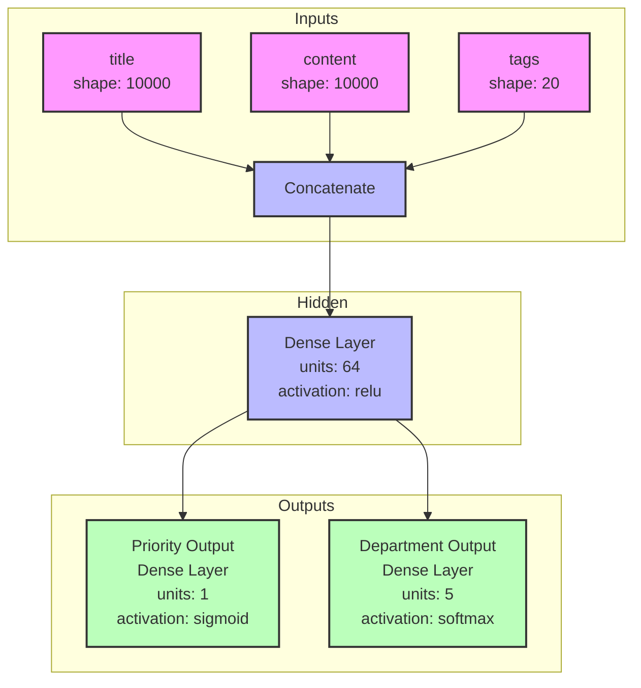
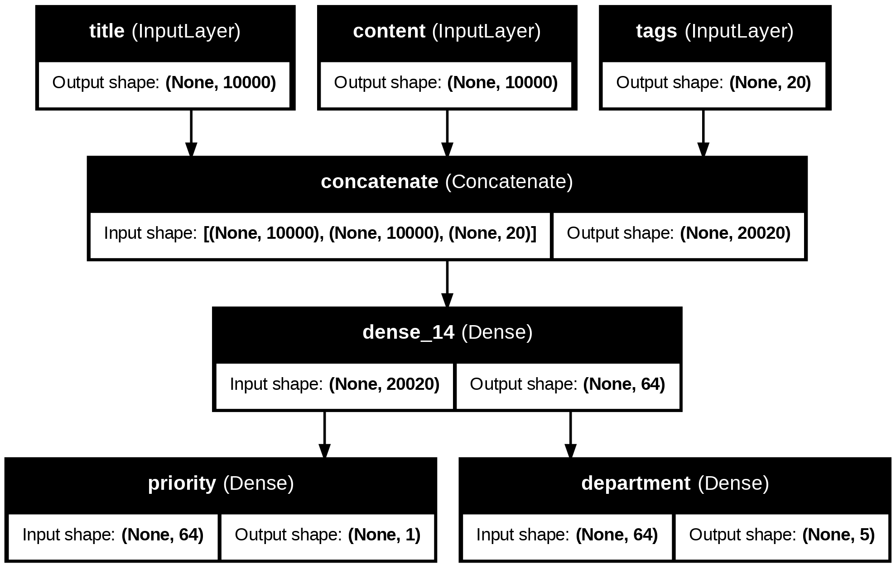
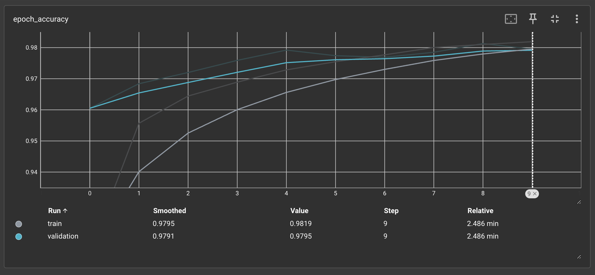

# 基礎篇
## 1. Layer
+ Layer 是神經網路的基本資料處理模組(data-processing module)，可以接受一個或多個張量輸入，再輸出一個或多個張量。Layer 的權重可視為該層的**狀態**(state)，在經過隨機梯度下降法(SGD)不斷更新權重(學習)，最終得到損失值最低的權重值。
### 分類
+ 不同格式的資料需要不同的層來處理。
  + **密集連接層(densely connected layer):** 又稱全連接層(fully connected layer)或密集層(dense layer)。如果資料輸入是簡單的 1D 向量資料，則多半是儲存在 2D 張量中，其 shape 為 (樣本 samples, 特徵 features)，通常是用
  + **循環層(recurrent layer)**: 如果輸入的資料是 2D 序列(sequence) 資料，多半是儲存在 3D 張量中，其 shape 為 (樣本 samples, 時戳 timestamps, 特徵 features)，如 LSTM 層。
  + **2D 卷積層**: 如果是 3D 影像資料，多半是儲存在 4D 張量中，通常使用 2D 卷積層(Conv2D Layer)

### Keras 中的基礎 Layer 類別
+ Layer 類別是 Keras 的核心，每個 Keras 元件都是一個 Layer 物件並與 Layer 有密切互動。Layer 是將一些狀態(權重)和運算(正向傳播)包在一起的物件。
+ 雖然權重可以在建構子 `__init__()` 中建立，但我們通常會使用 `build()` 來建立，然後用 `call()` 來執行正向傳播。
```python
from tensorflow import tf

class SimpleDemo(keras.layers.Layer):
    def __init__(self, units, activation=None):
        super().__init__()
        self.units = units
        self.activation = activation
    
	def build(self, input_shape):
		input_dim = input_shape[-1]
		self.W = self.add_weight(shape=(input_dim, self.units),initializer="random_normal")
		self.b = self.add_weight(shape=(self.units,),initializer="zeros")
	
	def call(self, inputs): 
		y = tf.matmul(inputs, self.W) + self.b
		if self.activation is not None:
			y = self.activation(y)
		return y
```
+ 我們可以像使用函式一樣來實例化 Layer 物件，其輸入為一個張量
```python
sample_layer = SimpleDemo(units=32, activation=tf.nn.relu)
```
+ 建立 `build()` 方法的意義在於，我們希望在第一次呼叫 layer 物件時才即時創建權重張量。
+ keras 會幫我們做好自動推論權重的 shape，我們可以把關注給放在如何定義 `build()`。
```python
model = keras.Sequential([
	SimpleDense(32, activation="relu"),
	SimpleDense(64, activation="relu"),
	SimpleDense(32, activation="relu"),
	SimpleDense(10, activation="softmax")
])
```
+ 事實上 `__call__()` 做的是遠不只推論 shape，還有 **eager 執行模式** 和 **graph 執行模式** 之的路徑選擇等等。

## 2. Model
+ 深度學習模型是由多個層所組成的結構，在 Keras 是以 **Model 類別**來建立模型物件。
+ 目前為止我們只使用過 `Sequential` 類別的模型(序列式模型)，由多個層簡單堆疊而成，有單一的輸入與單一的輸出。
+ 有其他常見的神經網路拓撲，如：
	+ 雙分支神經網路(Two-branch networks): 中間有分支，而非只有線性連接
	+ 多端口網路(Multihead networks): 有多個輸入端或輸出端
	+ 殘差連接(Residual connections): 某些層的輸出會分一條分支跳接到較遠的層
+ Keras 有兩種方式來建構這些非線性模型：
	1. 直接創建 Model 類別的子類別
	2. 使用函數式 API(functional API)

+ 模型的拓撲定義了一個假設空間(hypothesis space)，經由回饋訊號的指引，搜尋有用的輸入資料表示法。選擇完模型拓撲後，接著就是要找出可以發揮最好效果的權重張量。
+ 為了進行訓練，必須做一些假設，這些假設定義了模型可以學到的東西，所以假設空間的結構(模型架構)就變得格外重要，因為它會對現有問題的假設進行編碼，這些假設就是模型開始學習前的**先驗知識(prior knowledge)**

## 3. 編譯
+ 在 compile 之前，要先定義三件事情：
	1. 損失函數(loss function)
	2. 優化器(optimizer)
	3. 評量指標

+ 使用字串的方式定義優化器、損失函數、評量指標
```python
model = keras.Sequential([keras.layers.Dense(1)])
model.compile(optimizer="rmsprop",
							loss="mean_square_error",
							metrics=["accuracy"])
```
+ 使用物件實例的方式定義優化器、損失函數、評量指標
```python
model.compile(optimizer=keras.optimizer.RMSprop(),
						  loss=keras.losses.meanSquaredError(),
							metrics=[keras.metrics.BinaryAccuracy()])
```
+ 物件實例的方法可以用於調整客制化配置
```python
model.compile(optimizer=keras.optimizer.RMSprop(learning_rate=1e-4),
							loss=my_custom_loss,
							metrics=[my_custom_metric_1, my_custom_metric_2])
```

## 4. 選擇損失函數
+ 神經網路在學習過程中，設法降低損常值，所以如果損失函數與要達到的目標無相關時，可能會造成無效的訓練。
+ 二分元類問題: 二元交叉熵(binary crossentropy)
+ 多類別分類問題: 分類交叉熵(categorical crossentropy)

## 5. fit()
+ 輸入(input) 與目標值(targets): 用來訓練的資料，包括輸入樣本和目標答案。資料通常以 NumPy 陣列或 Tensorflow 的 Dataset 物件傳入。
+ 週期數(epochs): 訓練的迴圈數。
+ 批次量(batch_size): 每一週期中，進行小批次梯度下降訓練時的批次量，也就是多少樣本進行一次梯度更新。
+ `fit()` 會回傳一個 History 物件，該物件是一個字典，key 是特定的評量指標名稱，value 是每一週期的損失值或指標值。
```python
history = model.fit(
	inputs,
	targets,
	epochs=5,
	batch_size=128
)
```

## 6. 驗證資料
+ 通常我們會將資料分為「訓練集」與「驗證集」，因為我們的目的並非只在訓練資料上表現良好，也需要在面對新資料時，有良好的預測。
```python
model = keras.Sequential([keras.layers.Dense(1)])
model.compile(optimizer=keras.optimizer.RMSprop(learning_rate=0.1),
   					  loss=keras.losses.MeanSquaredError(),
							metrics=[keras.metrics.BinaryAccuracy()])

# 洗牌
indices_permutation = np.random.permutation(len(inputs))
shuffled_inputs = inputs[indices_permutation]
shuffled_targets = targets[indices_permutation]

# 用 3 成的資料做為驗證集
num_validation_samples = int(0.3 * len(inputs)) 
val_inputs = shuffled_inputs[:num_validation_samples]
val_targets = shuffled_targets[:num_validation_samples]
training_inputs = shuffled_inputs[num_validation_samples]
training_target = shuffled_targets[num_validation_samples]
model.fit(
	training_inputs,
	training_targets,
	epochs=5
	batch_size=16,
	validation_data=(val_inputs, val_targets0)
)
```

+ 若訓練結束後，若想用特定資料來計算驗證損失和驗證指標值，可以使用 `evaluate()` 方法。
```python
loss_and_metrics = model.evaluate(val_inputs, val_targets, batch_size=128)
```

## 7. 推論(Inference)
+ 模型訓練好後，要拿寫對新資料進行預測，這個過程就稱為**推論(inference)**。
	+ 對所有的資料一次進行推論
	```python
	predictions = model(new_inputs)
	```
	+ 對小批次的資料進行預測
	```python
	predictions = model.predict(new_inputs, batch_size=128)
	```

# 進階篇
## 建構 Keras 模型的不同方法
+ Keras 建構模型有三種 API 可以選擇
	1. 序列式模型
	2. 函數式 API
	3. 繼承 Model 類別(Model subclassing)

	```mermaid
	flowchart LR
    A["序列式API+內建神經層<br/>簡單模型"] --> 
		B["函數式API+內建神經層<br/>處理一般任務"] --> 
		C["函數式API+自定神經層<br/>處理特殊任務"] --> 
		D["使用子類別<br/>研究模型行為"]
	```
### 1. 序列式模型 (Sequential Model)
+ 建構 Keras 模型最簡單的做法就是使用 Sequential Model
```python
from tensorflow import keras
from tensorflow.keras import layers

model = keras.Sequential([
    layers.Dense(64, activation="relu"),
    layers.Dense(10, activation="softmax")
])
```
+ 也可以用 `add()` 來逐步建構模型
```python
model = keras.Sequential()
model.add(layers.Dense(64, activation="relu"))
model.add(layers.Dense(10, activation="softmax"))
```
+ 注意，只有在執 行首次呼叫神經層或是呼叫 `build(input_size)` 並輸入指定輸入的 shape 時，才會產生權重。
```python
model.build(input_size=(None, 3))
model.weights
```
+ 可以透過 `model.summary()` 來檢視模型內容
```python
model.summary()
```

+ 也可以為模型命名
```python
model = keras.Sequential(name="my_sequential_model")
model.add(layers.Dense(64, activation="relu", name="hidden_layer"))
model.add(layers.Dense(10, activation="softmax", name="output_layer"))
model.build(input_shape=(None, 3))
model.summary()
```

+ 也可以提前宣告輸入的 shape
```python
model = keras.Sequential()
model.add(keras.Input(shape=(3,)))
model.add(layers.Dense(64, activation="relu"))
model.summary()
```


### 2. 函數式 API (Functional API)
+ 序列式模型的應用範圍比較有限，因為只能建構一層接一層的模型，因此只能建構單一輸入與單一輸出的模型，但實際應用時，我們有可能會遇到多元輸入、多元輸出的情況，或是在模型內部建構，有非線性拓撲(topology)的需求。
```python
inputs = keras.Input(shape=(3,), name="funtinoal_api")     # 實際上這一層並非一個神經層，只是用來建立模型輸入點的張量物件
features = layers.Dense(64, activation="relu")(inputs)
outputs = layers.Dense(10, activation="softmax")(features)
model = keras.Model(inputs=inputs, outputs=outputs)
model.summary()
```

+ 可以查看 layer 的 shape 與 dtype。
	+ 這樣的 layer 被稱為**符號張量(symbolic tensor)**
	+ 其中第 0 軸為 None，因為批次量為變數，其量不固定。第 1 軸需與單一樣本的維度相同。
```python
print(inputs.shape)
print(inputs.dtype)
print(features.shape)
print(features.dtype)

> (None, 3)
> float32
> (None, 64)
> float32
```

+ 多輸入、多輸出的模型
```python
news_size = 10000
tag_size = 20
department_size = 5

title = keras.Input(shape=(news_size,), name="title")
content = keras.Input(shape=(news_size,), name="content")
tags = keras.Input(shape=(tag_size,), name="tags")

features = layers.Concatenate()([title, content, tags])
features = layers.Dense(64, activation="relu")(features)

priority = (layers.Dense(1, activation="sigmoid", name="priority")(features))
department = (layers.Dense(department_size, activation="softmax", name="department")(features))

model = keras.Model(inputs=[title, content, tags], outputs=[priority, department])
```

+ 訓練多輸入、多輸出模型
	+ 按順序提供輸入、目標
	```python
	import numpy as np

	n = 1280

	title_data = np.random.randint(0, 2, size=(n, news_size))
	content_data = np.random.randint(0, 2, size=(n, news_size))
	tags_data = np.random.randint(0, 2, size=(n, tag_size))
	priority_data = np.random.random(size=(n, 1))
	department_data = np.random.randint(0, 2, size=(n, department_size))

	model.compile(optimizer="rmsprop",
								loss=["mean_squared_error", "categorical_crossentropy"],
								metrics=[["mean_absolute_error"], ["accuracy"]])
	model.fit([title_data, content_data, tags_data],
						[priority_data, department_data],
						epochs=1)

	model.evaluate([title_data, content_data, tags_data],
								[priority_data, department_data])

	priority_preds, department_preds = model.predict([title_data, content_data, tags_data])
	```

	+ 使用字典輸入、目標
	```python
	import numpy as np 

	n = 1280

	title_data = np.random.randint(0, 2, size=(n, news_size))
	content_data = np.random.randint(0, 2, size=(n, news_size))
	tags_data = np.random.randint(0, 2, size=(n, tag_size))
	priority_data = np.random.random(size=(n, 1))
	department_data = np.random.randint(0, 2, size=(n, department_size))

	model.compile(
		optimizer='rmsprop', 
		loss={
			"priority": "mean_squared_error",
			"department": "categorical_crossentropy"}, 
		metrics={
			"priority": ["mean_absolute_error"],
			"department": ["accuracy"]})

	model.fit({
			"title": title_data,
			"content": content_data,
			"tags": tags_data
	}, {
			"priority": priority_data,
			"department": department_data   
	}, epochs=1)

	model.evaluate({
			"title": title_data,
			"content": content_data,
			"tags": tags_data
	}, {
			"priority": priority_data,
			"department": department_data   
	})

	priority_preds, department_preds = model.predict({
			"title": title_data,
			"content": content_data,
			"tags": tags_data
	})
	```

+ 函數式 API 促成了兩個重要的功能:
	+ 模型視覺化(model visualization)
	+ 特徵萃取(feature extraction)

+ 我們可以用 `plot_model()` 來畫出模型的拓樸結構
```python
from keras.utils import plot_model
plot_model(model, "news_classifier.png")
```


+ 並且我們可以使用 `model.layers` 來查看神經層的輸入與輸出的張量物件
```python
model.layers

> [<InputLayer name=title, built=True>,
   <InputLayer name=content, built=True>,
   <InputLayer name=tags, built=True>,
   <Concatenate name=concatenate, built=True>,
   <Dense name=dense_14, built=True>,
   <Dense name=priority, built=True>,
   <Dense name=department, built=True>]
```

+ 透過函數式 API，我們可以在既有的舊模型架構上，新增新的分支，有利於使用舊模型的中間特徵。

+ 範例，在既有模型下，新增一個輸出 **potential**
```python
features = model.layers[4].output
potential = layers.Dense(3, activation="softmax", name="potential")(features)
new_model = keras.Model([title, content, tags],
                        [priority, department, potential])
plot_model(new_model, "new_news_classifier.png", show_layer_names=True)
```

### 3. 繼承 Model 類別 (Subclassing the model class)
+ 在 `__init__()` 方法中，定義模型會用到的神經層。
+ 在 `call()` 方法中定義模型中的各神經層的定向傳播流程
+ 實例化定義好的子類別

+ 改寫先前的範範為 model 子類別
```python
class NewsModel(keras.Model):
    def __init__(self, n):  
        super().__init__()   # 要先呼叫父類別的初始化函式
        self.concat_layer = layers.Concatenate()
        self.mixing_layer = layers.Dense(64, activation='relu')
        self.priority_scorer = layers.Dense(1, activation='sigmoid')
        self.department_scorer = layers.Dense(n, activation='softmax')

    def call(self, inputs):  # 定義正向傳播的過程
        title = inputs["title"]
        content = inputs["content"]
        tags = inputs["tags"]
        features = self.concat_layer([title, content, tags])
        features = self.mixing_layer(features)
        priority = self.priority_scorer(features)
        department = self.department_scorer(features)
        return priority, department

model = NewsModel(n=5)
priority, department = model({
    "title": title_data,
    "content": content_data,
    "tags": tags_data})
```
+ 進行編譯與訓練
```python
model.compile(optimizer='rmsprop',
              loss=['mean_squared_error', 'categorical_crossentropy'],
              metrics=[['mean_absolute_error'], ['accuracy']])

model.fit({
    "title": title_data,
    "content": content_data,
    "tags": tags_data
}, [priority_data, department_data], epochs=1)

model.evaluate({
    "title": title_data,
    "content": content_data,
    "tags": tags_data
}, [priority_data, department_data])

priority_preds, department_preds = model.predict({
    "title": title_data,
    "content": content_data,
    "tags": tags_data
})
```

+ Sequential 與 Functional 只能建構有向無環圖(acyclic graph)而在 subclassing 中則沒有限制，我們可以透過在 `call()` 來設計流程，甚至可以用 **for 迴圈** 或是**遞迴(recursion)** 的方式來自由定義。

+ 但使用 subclassing 也有缺點
	+ 無法使用 `summary()` 與 `plot_model()`
	+ 無法取得神經層的圖節點進行特徵萃取

### Mixing
+ 當然也可以搭配使用
	+ 含有 model 子類別的函數式模型
	```python
	class Classifier(keras.Model):
			def __init__(self, n):
					super().__init__()
					if n == 2:
							units = 1
							activation = 'sigmoid'
					else:
							units = n
							activation = 'softmax'
					self.dense = keras.layers.Dense(units, activation=activation)

			def call(self, inputs):
					return self.dense(inputs)

	inputs = keras.Input(shape=(3,))
	features = layers.Dense(64, activation="relu")(inputs)
	outputs = Classifier(n=10)(features)
	model = keras.Model(inputs=inputs, outputs=outputs)
	```

	+ 包有函數式模型的 model 子類別
	```python
	inputs = keras.Input(shape=(64,))
	outputs = layers.Dense(1, activation='sigmoid')(inputs)
	binary_classifier = keras.Model(inputs, outputs)

	class MyModel(keras.Model):
			def __init__(self, n):
					super().__init__()
					self.dense = layers.Dense(64, activation='relu')
					self.classifier = binary_classifier

			def call(self, inputs):
					features = self.dense(inputs)
					return self.classifier(features)

	model = MyModel(n=5)
	```

## 設計評量指標
### 方均根誤差(root mean squared error, RMSE)
```python
import tensorflow as tf

class RootMeanSquaredError(tf.keras.metrics.Metric):
    def __init__(self, name="rmse", **kwargs):
        super().__init__(name=name, **kwargs)
        self.mse_sum = self.add_weight(name="mse_sum", initializer="zeros")
        self.total_samples = self.add_weight(name="total_samples", initializer="zeros", dtype="int32")
    
    def update_state(self, y_true, y_pred, sample_weight=None):
        y_true = tf.one_hot(y_true, depth=tf.shape(y_pred)[1])
        mse = tf.reduce_sum(tf.square(y_true - y_pred))
        self.mse_sum.assign_add(mse)
        num_samples = tf.shape(y_pred)[0]
        self.total_samples.assign_add(num_samples)
    
    def result(self):
        rmse = tf.sqrt(self.mse_sum / tf.cast(self.total_samples, tf.float32))
        return rmse

    def reset_state(self):
        self.mse_sum.assign(0.)
        self.total_samples.assign(0)

model = get_mnist_model()
model.compile(optimizer="adam",
              loss="sparse_categorical_crossentropy",
              metrics=["accuracy", RootMeanSquaredError()])
model.fit(train_images, train_labels,
          epochs=3,
          validation_data=(val_images, val_labels))
test_metrics = model.evaluate(test_images, test_labels)
```

## 使用 callbacks 模組
+ callback 時指在呼叫 `fit()` 方法時可以傳遞給模型的一個物件，並可在訓練階段的各個時間點由模型所呼叫。
+ 可以用於檢視模型狀態及表示，進而執行各類操作如中斷訓練、儲存模型、載入不同權重集合或更改模型狀態。
+ 常見的 callback 模組有：
	+ `keras.callbacks.ModelCheckpoint`
	+ `keras.callbacks.EarlyStopping`
	+ `keras.callbacks.LearningRateSchedular`
	+ `kears.callbacks.ReduceLROnPlateau`
	+ `keras.callbacks.CSVLogger`


### EarlyStopping + ModelCheckpoint
```python
callbacks = [
    keras.callbacks.EarlyStopping(
        monitor="val_accuracy",   #監控模型的驗證準確度
        patience=2,   # 超過兩個週期沒有改善就停止
    ),
    keras.callbacks.ModelCheckpoint(       # 在每個週期結束後儲存模型
        filepath="checkpoint_path.keras",  # 存檔路徑及檔名
        monitor="val_loss",
        save_best_only=True,               # 當 val_loss 有改善時才儲存模型
    )
]

model = get_mnist_model()
model.compile(optimizer="adam",
              loss="sparse_categorical_crossentropy",
              metrics=["accuracy"])   # 對應到監控
model.fit(train_images, train_labels,
          epochs=10,
          callbacks=callbacks,       # 在 training 時加入 callbacks
          validation_data=(val_images, val_labels))  # 一定要加入驗證集
```

### 設計 custom callback
+ 有以下的呼叫時間點的方法可以自定義:
	+ `on_epoch_begin(epoch, logs)`  # 在每個訓練週期的開始時呼叫 
	+ `on_epoch_end(epoch, logs)`    # 在每個訓練週期的結束時呼叫
	+ `on_batch_begin(batch, logs)`  # 在處理每個批次資料前呼叫
	+ `on_batch_end(batch, logs)`    # 在處理每個批次資料後呼叫
	+ `on_train_begin(logs)` 			   # 在訓練開始時呼叫
	+ `on_train_end(logs)`   			   # 在訓練結果時呼叫
```python
from matplotlib import pyplot as plt

class LossHistory(keras.callbacks.Callback):
	def on_train_begin(self, logs):
		self.per_batch_losses = []

	def on_batch_end(self, batch, logs):
		self.per_batch_losses.append(logs.get('loss'))

	def on_epoch_end(self, epoch, logs):
		plt.clf()
		plt.plot(range(len(self.per_batch_losses)),
			self.per_batch_losses,
			label='Training loss for each batch')
		plt.xlabel(f'Batch (epoch {epoch})')
		plt.ylabel("Loss")
		plt.legend()
		plt.savefig(f"plot_at_epoch_{epoch}")
		self.per_batch_losses = []

model = get_mnist_model()
model.compile(optimizer="adam",
              loss="sparse_categorical_crossentropy",
              metrics=["accuracy"])
model.fit(train_images, train_labels,
          epochs=10,
          callbacks=[LossHistory()],
          validation_data=(val_images, val_labels))
```

## 使用 TensorBoard
+ TensorBoard 是一個以瀏覽器為基礎的視覺化工具，可以在本地端運行。可以用來在訓練進行時，監控模型內部變化的最佳方法。
+ 使用的方法是在 `fit()` 中引入 `keras.callbacks.TensorBoard`。
```python
model = get_mnist_model()
model.compile(optimizer="adam",
              loss="sparse_categorical_crossentropy",
              metrics=["accuracy"])
tensorboard = keras.callbacks.TensorBoard(
    log_dir="/tensor_board_log"  # 定記錄檔案的寫入位置
)
model.fit(train_images, train_labels,
          epochs=10,
          validation_data=(val_images, val_labels),
          callbacks=[tensorboard])
```
+ 接著輸入以下指令開啟 TensorBoard 介面
```python
%load_ext tensorboard
%tensorboard --logdir /tensor_board_log
```


# 實作演練
+ 重心在實作一次 mnist
```python
from tensorflow import keras
from tensorflow.keras import layers
from tensorflow.keras.datasets import mnist

def get_mnist_model():
    inputs = keras.Input(shape=(28 * 28,))
    features = layers.Dense(512, activation="relu")(inputs)
    features = layers.Dropout(0.5)(features)
    outputs = layers.Dense(10, activation="softmax")(features)
    model = keras.Model(inputs=inputs, outputs=outputs)
    return model

(images, labels), (test_images, test_labels) = mnist.load_data()
images = images.reshape((60000, 28 * 28)).astype("float32") / 255
test_images = test_images.reshape((10000, 28 * 28)).astype("float32") / 255
train_images, val_images = images[10000:], images[:10000]
train_labels, val_labels = labels[10000:], labels[:10000]

model = get_mnist_model()
model.compile(optimizer="adam",
              loss="sparse_categorical_crossentropy",
              metrics=["accuracy"])
model.fit(train_images, train_labels, epochs=3,
          validation_data=(val_images, val_labels))
test_metrics = model.evaluate(test_images, test_labels)
predictions = model.predict(test_images)
print(test_metrics)
```

