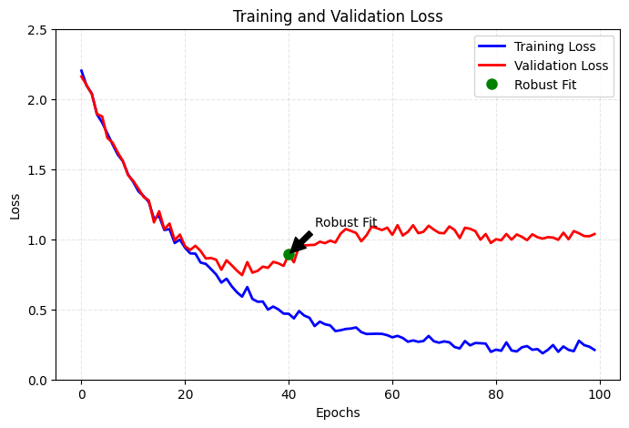
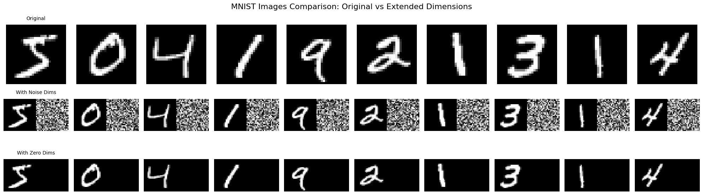
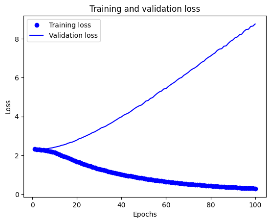
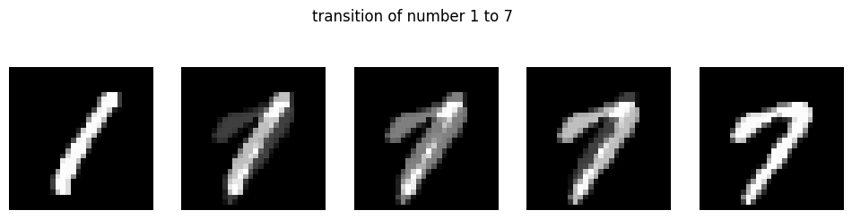

> 機器學習最重要的兩件事是：  
> 1. 準確的模型評估  
> 2. 訓練次數與普適化之間的平衡

## 普適化(generalization)
+ 普適化是機器學習的終極目標，什麼是普適化呢？首先要先解釋是什麼**低度擬合(underfitting)** 與 **過度擬合(overfitting)**。
    + 觀察下方的圖，訓練集與驗證集在訓練初期，損失值都穩定下降，此時稱為 underfitting，代表神經網路尚未學習到資料中的共同特徵。經過一定時間後，驗證指標會開始停滯並開始變差，這代表模型開始發生 overfitting，代表模型已經額外學習了一些只有訓練集中的特徵，進而可能在面對新資料時造成干擾。而 **穩健擬合(robust fit)** 是 underfitting 與 overfitting 之間的點，代表最佳的 epochs。
    
    + 下圖的黑線與就是 robust fit 的表現，綠線是 overfitting 的表現。
        + 可以看到綠線在訓練集有很好的表現，但可能會在新的資料點進入時，有錯誤的判斷。
        + **普適化**就是找到一個面對所有資料都能有穩定且好的表現的模型。
    

### overfitting 
+ overfitting 容易發生在
    1. 具有雜訊的資料
    2. 具有罕見特徵
    3. 標示錯誤的資料
    + 如果訓練過程，模型針對這些離群值(outlier)進行學習，普適化表現自然會下降。

### 模糊特徵
+ 然後並非所有雜訊都是由不準確性(特徵模糊/標示錯誤)產生的，當處理的問題本身就具備不確定性或模棱兩可時，就算是字跡清晰、標籤正確也可能是雜訊，特別是一些沒有明確界線的特徵。
> 就像是下面的三杯一樣的水，由不同的人來 label，也會 label 出不一樣的答案。

+ 最有感的就是問卷量表，客戶滿意度 (CSAT) 調查問卷通常分為 1 (非常不滿意) 到 5 分 (非常滿意) 。每個人對於滿意度的給分都不一致，所以就容易產生差異。
+ 穩健的模型會忽略訓練資料中個別的資料點，從眾數著眼。

### 罕見特徵(rare feature)與虛假關聯(spurious correlation)
+ **罕見特徵**: 通常是樣本中出現頻率極低的特徵，可能具有高辨識度或影響力，但也可能是噪音，需要小心解讀。
    1. 事故發生的地點是某條高速公路上極少使用的臨時匝道。
    2. 事故發生時段是凌晨2點到3點，且伴隨濃霧天氣。
    3. 涉事車輛是一輛載有易燃化學品的大型貨車，並與一輛滿載乘客的大巴相撞。
    + 如何影響機器學習：
        + 特徵稀疏性： 這些罕見的特徵組合在訓練數據中可能只出現過1-2次，但其後果卻極為嚴重（多人傷亡），模型可能過度強調這些罕見情況作為高危因素。
        + 過擬合風險： 如果模型只根據這些少量案例進行學習，可能無法有效處理未見過的場景（如不同的道路或車輛組合）。
+ **虛假關聯**: 則是數據之間表面上有相關性，但實際上缺乏因果關係，可能由於第三因素驅動或純粹的巧合。
    + 冰淇淋銷量與溺水事件：
        + 描述：夏季冰淇淋銷量與溺水事件呈現高度正相關。
        + 原因：兩者都與溫度升高相關，並非冰淇淋銷量導致溺水事件增加。

+ 接下來來做一個實驗，我們在每一張數字中擴充維度，分別擴充 noise 與 zeros

```python
from tensorflow.keras.datasets import mnist
import numpy as np

(train_images, train_labels), (test_images, test_labels) = mnist.load_data()

train_images = train_images.reshape((60000, 28*28))
train_images = train_images.astype("float32") / 255

train_images_with_noise = np.concatenate(
    [train_images, np.random.random((len(train_images), 784))], axis=1
)
train_images_with_zeros = np.concatenate(
    [train_images, np.zeros((len(train_images), 784))], axis=1
)
```
+ 接著我們用這兩個資料集來進行 training，來觀察訓練後的結果：
```python
from tensorflow import keras
from tensorflow.keras import layers

def build_model():
    model = keras.Sequential([
        layers.Dense(512, activation="relu"),
        layers.Dense(10, activation="softmax")
    ])

    model.compile(
        optimizer="rmsprop",
        loss="sparse_categorical_crossentropy",
        metrics=["accuracy"])
    return model

model = build_model()
history_noise = model.fit(train_images_with_noise, train_labels, epochs=10, batch_size=128, validation_split=0.2)
history_zeros = model.fit(train_images_with_zeros, train_labels, epochs=10, batch_size=128, validation_split=0.2)
```
+ 畫出損失曲線
```python
import matplotlib.pyplot as plt
val_acc_noise = history_noise.history["val_accuracy"]
val_acc_zeros = history_zeros.history["val_accurarc"]
epochs = range(1, 11)
plt.plot(epochs, val_acc_noise, "b-", label="data with noise")
plt.plot(epochs, val_acc_zeros, "r-", label="data with zeros")
plt.title("Effect of noise channels on validtaion accuracy")
plt.xlabel("Epochs")
plt.ylabel("Validation accuracy")
plt.legend()
```

+ 可見兩組資料擁有相同的有效特徵資訊，但所訓練出來的模型在驗證準確度卻有明顯的差異，這差距來自於虛假關聯：但加入的雜訊愈多，準確度就會愈低。
+ 雜訊幾乎都會造成 overfitting，故若不確定各種特徵是有用或無用時，通常要在訓練前進行特徵挑選(feature selection)。例如先前在 IMDB 資料，便時採用前 10000 個常用字。
    + 常用的方法還包括特量每個特徵對於任務關聯性的量測，如特徵與標籤之間的 MI(mutual information) 分數，只保留分數在一定門閾值以上的特徵，用以過濾雜訊。

## 普適化的本質
+ 事實上，只要模型具備足夠的學習能力，便可以持續訓練到能夠擬合任何的資料。
+ 我們可以做一個實驗，將 mnist 的資料集的標籤打亂來進行訓練，此時圖片中的數字已與標籤無關聯，但訓練的失曲線仍會隨著訓練推進而持續下降。
```python
from tensorflow import keras
from tensorflow.keras import layers
from tensorflow.keras.datasets import mnist
import numpy as np
 
(train_images, train_labels), _ = mnist.load_data()
train_images = train_images.reshape((60000, 28*28))
train_images = train_images.astype("float32")/255

random_train_labels = train_labels[:]
np.random.shuffle(random_train_labels)

model = keras.models.Sequential([
    layers.Dense(512, activation="relu"),
    layers.Dense(10, activation="softmax")
])
model.compile(optimizer='adam',
              loss='sparse_categorical_crossentropy',
              metrics=['accuracy'])
history = model.fit(train_images, random_train_labels, epochs=100,batch_size=128,validation_split=0.2)

import matplotlib.pyplot as plt
loss = history.history['loss']
val_loss = history.history['val_loss']
epochs = range(1, len(loss) + 1)

plt.plot(epochs, loss, 'bo', label='Training loss')
plt.plot(epochs, val_loss, 'b', label='Validation loss')
plt.title('Training and validation loss')
plt.xlabel('Epochs')
plt.ylabel('Loss')
plt.legend()
plt.show()
```

+ 代表只要訓練次數夠多，終究能擬合訓練資料，就像是 dictionary 一樣，輸入與標籤就猶如字典的 key 與 value 一樣。

### 流形假說(manifold hypothesis)
+ 真實世界的高維數據通常位於低維流形(manifold)上，這些數據點雖然存在於高維空間，但實際上具有更低的內在維度。
+ 以 MNIST 為例，雖然每張圖片是 28×28=784 維的數據，但實際上所有手寫數字圖片大致分布在一個低維流形上
+ 簡單想像你在玩一個猜拳的遊戲(剪刀、石頭、布)：
    + 高維空間的概念
        + 如果你用相機拍下出拳的手勢，每張照片可能是 1000×1000 像素，這代表每張照片在數學上是個 100 萬維的數據點，但實際上，手勢只有剪刀、石頭、布三種可能。
    + 流形的概念
        + 雖然照片是高維的，但手勢的變化是有限的，你可以慢慢從剪刀變成石頭，手指會沿著某個固定的軌跡彎曲，這個軌跡就像是一條"路徑"，這就是所謂的流形。



```python
import tensorflow as tf
import numpy as np
import matplotlib.pyplot as plt
from tensorflow.keras.datasets import mnist

# 載入 MNIST 數據
(x_train, y_train), _ = mnist.load_data()
x_train = x_train.astype('float32') / 255.

# 找出數字 1 和 7 的例子
digit_1 = x_train[y_train == 1][0]
digit_7 = x_train[y_train == 7][0]

# 創建中間過渡圖片
steps = 5
transitions = []
for i in range(steps):
    alpha = i / (steps-1)
    # 簡單的線性混合
    mixed = digit_1 * (1-alpha) + digit_7 * alpha
    transitions.append(mixed)

# 顯示結果
plt.figure(figsize=(12, 3))
for i in range(steps):
    plt.subplot(1, steps, i+1)
    plt.imshow(transitions[i], cmap='gray')
    plt.axis('off')
plt.suptitle('transition of number 1 to 7')
plt.show()
```



### 以內插法作為普適化的基礎
+ 深度學習的普適化能力，很大程度上依賴於模型能夠在訓練數據的流形上進行合理的內插。讓我們通過實驗來比較**流形內插**和**線性內插**的差異：

### 為何深度學習能運作
+ 流形假說幫助我們理解為什麼深度學習能夠有效運作：
    1. 流形學習：深度學習模型通過多層結構，逐漸學習數據的內在流形結構。
    2. 維度降低：神經網絡的中間層實際上在執行非線性維度降低，將高維輸入映射到更有意義的低維表示。
    3. 連續變化：在流形上的內插產生的是連續、平滑的變化，而不是簡單的線性混合：
        + 線性內插：直接在像素空間中進行混合，可能產生不自然的中間狀態
        + 流形內插：在學習到的流形空間中進行內插，產生的中間狀態更符合實際數據分布
    4. 歸納能力：模型的普適化能力很大程度上來自於它能夠在流形上進行合理的內插，而不是簡單地記住訓練數據。

+ 這個實驗展示了為什麼簡單的線性內插會產生模糊或不自然的結果，而流形內插能產生更真實的過渡狀態。這也說明了深度學習模型不僅僅是在記憶數據，而是真正學習到了數據的內在結構。