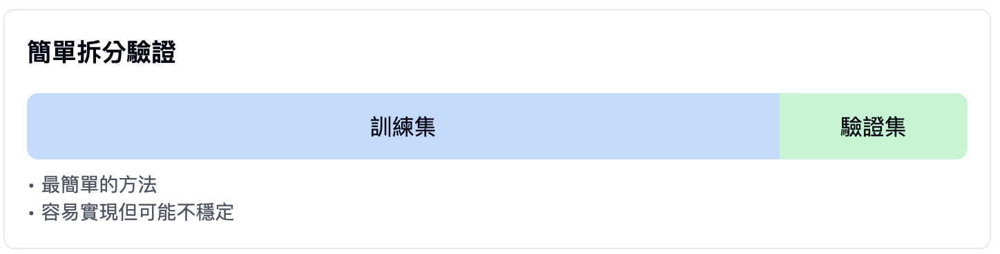
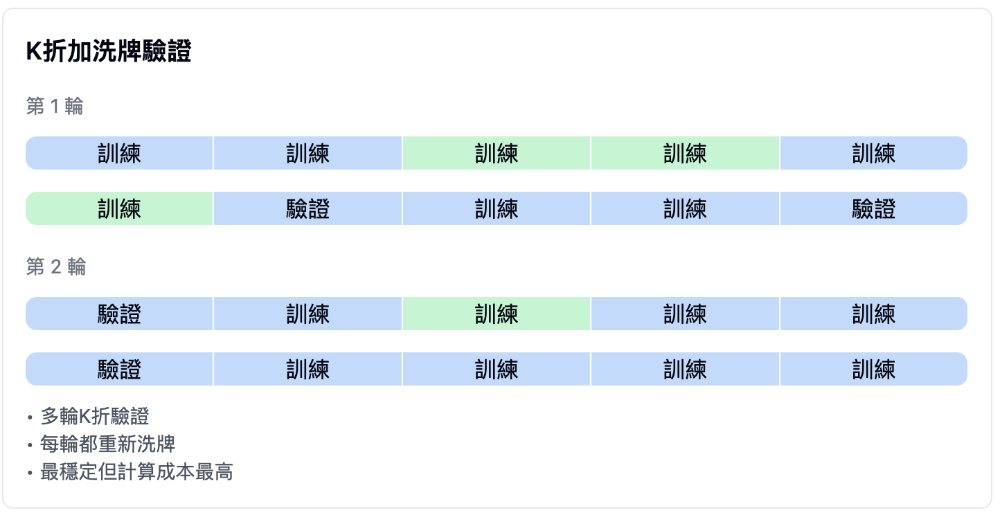

## 評估模型
機器學習模型就像是一個需要不斷練習的學生，我們需要適當的方法來評估它的學習成果。今天讓我們來了解如何科學地評估一個模型的表現。

### 何為訓練集、驗證集、測試集
在開始解釋不同的數據集之前，我們先來理解兩種重要的參數：
1. 權重參數(weight parameter)：
    + 這是模型通過學習自動調整的參數
    + 就像學生在解題過程中學到的解題技巧

2. 超參數(hyperparameter)：
    + 這是我們需要手動設置的參數
    + 就像是老師設定的學習進度和難度

數據集的三個部分各自扮演著不同的角色：
1. 訓練集：
    + 用於模型的主要學習階段
    + 調整權重參數
    + 佔總數據量約 60-80%

2. 驗證集：
    + 用於調整超參數
    + 幫助我們選擇最佳的模型配置
    + 佔總數據量約 10-20%

3. 測試集：
    + 用於最終的模型評估
    + 模擬真實世界的應用場景
    + 佔總數據量約 10-20%

### 資料洩漏(information leak):
+ 指測試資料的訊息不當地影響了模型訓練，就像是考試前看到了試題，會導致模型評估結果不可靠。

### 進階驗驗方法
+ 當資料不足時，就可能要採用一些進階方法來處理，以下介紹三種經典方法：
#### 簡單拆分驗證(simple holdout validation)：

+ 最基本的方法
+ 直接將數據分為訓練集和驗證集
+ 優點：簡單、快速
+ 缺點：結果可能不穩定

#### K折驗證(k-fold validation)：

+ 將數據分為K個相等的部分
+ 每次使用其中一部分作為驗證集
+ 重複K次，取平均結果
+ 優點：更穩定的評估結果
+ 常用的K值為5或10

#### K折加洗牌驗證(Iterated K-fold validation with shuffling)：

+ 在K折驗證的基礎上增加多輪重複
+ 每輪都重新打亂數據順序
+ 優點：最穩定的評估結果
+ 缺點：計算成本較高