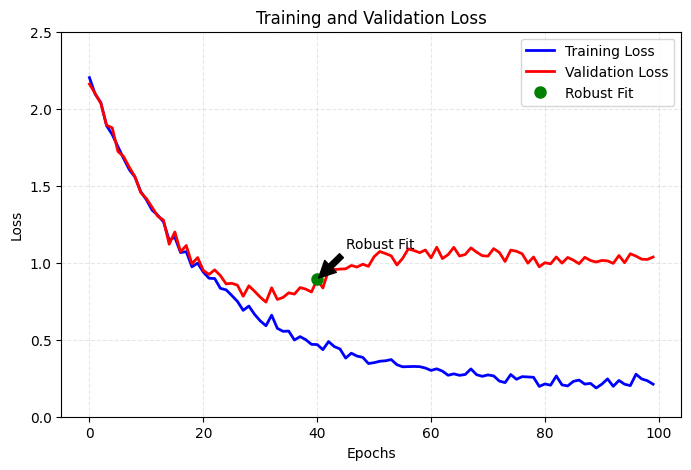
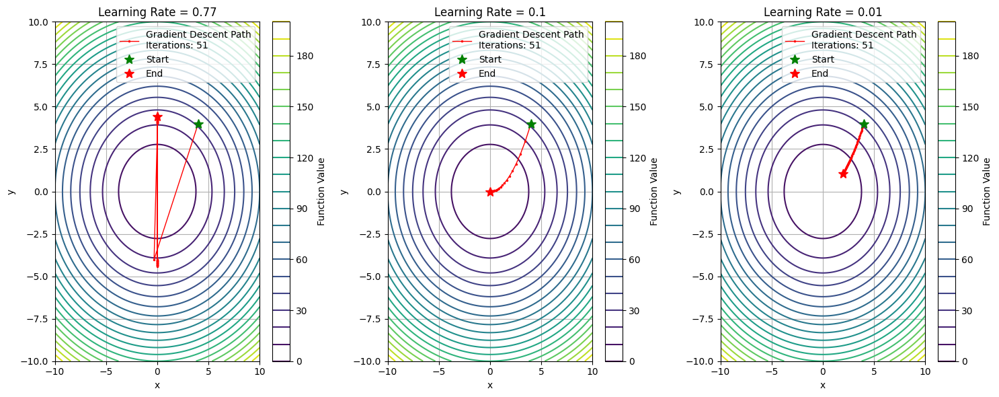
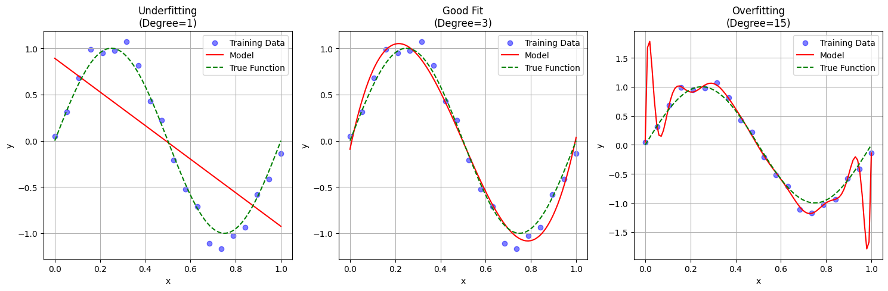

+ 要達到完美擬合(perfect fit)，勢必要先經歷過度擬合(overfitting)，否則我們無法預先知道邊界在哪裡。

+ 因此我們要處理任何機器學習問題的初始目標，便是訓練出一個能展現基本普適化能力，並且會發生 overfitting 的模型，接著才可以專注在解決 overfitting 並提升模型的普適化能力。
+ 我們會遇到三個 status:
    1. 訓練沒有成效，損失值降不下來。
	2. 訓練可行，但無法展現普適化，無法超越基準線。
	3. 訓練可行且表現也超越基準線，但無法達到 overfitting。

## 調整梯度下降的關鍵參數
+ 當訓練沒有成效，代表損失無法下降。
+ 一般而言，就算資料是隨機的，模型有辦法擬合，所以損失無法下降通常可以斷定是 gradient descent 的參數設置需要調整，包含:
	1. 優化器(optimizer)  
	2. 初始權重(initial weight)  
	3. 學習率(learning rate)  
	4. 批次量(batch size)  


+ 從上圖可見，當學習率太大時，每一次的跨幅過大，使 loss 無法降低；當學習率太小時，每次跨幅太小，訓練的效率不好，當學習率適當時，可以達到最好的成效。


```python
import numpy as np
import matplotlib.pyplot as plt

def objective_function(x, y):
    return 0.7*x**2 + 1.3*y**2

def gradient(x, y):
    return np.array([1.4*x, 2.6*y])

def gradient_descent(learning_rate, start_point, n_iterations=50):
    path = [start_point]
    point = np.array(start_point)
    
    for _ in range(n_iterations):
        grad = gradient(point[0], point[1])
        point = point - learning_rate * grad
        path.append(point.copy())
        
        if np.linalg.norm(grad) < 1e-6:
            break
    
    return np.array(path)

x = np.linspace(-10, 10, 100)  # 擴大範圍到 ±10
y = np.linspace(-10, 10, 100)
X, Y = np.meshgrid(x, y)
Z = objective_function(X, Y)

plt.figure(figsize=(15, 6))

learning_rates = [0.77, 0.1, 0.01]
titles = ['Learning Rate = 0.77', 'Learning Rate = 0.1', 'Learning Rate = 0.01']
start_point = np.array([4.0, 4.0])

for i, (lr, title) in enumerate(zip(learning_rates, titles)):
    plt.subplot(1, 3, i+1)
    
    plt.contour(X, Y, Z, levels=20, cmap='viridis')
    
    path = gradient_descent(lr, start_point)
    plt.plot(path[:, 0], path[:, 1], 'r.-', linewidth=1, markersize=3, 
             label=f'Gradient Descent Path\nIterations: {len(path)}')
    
    plt.plot(path[0, 0], path[0, 1], 'g*', markersize=10, label='Start')
    plt.plot(path[-1, 0], path[-1, 1], 'r*', markersize=10, label='End')
    
    plt.title(title)
    plt.xlabel('x')
    plt.ylabel('y')
    plt.legend()
    plt.colorbar(label='Function Value')
    plt.grid(True)

plt.tight_layout()
plt.show()
```


## 使用不同的架構
+ 選擇合適的模型架構處理不同類型的問題
+ DNN
+ CNN(Convolutional Neural Networks)
+ RNN(Recurrent Neural Networks)
+ Transformer
+ Autoencoders
+ GAN(Generative Adversarial Networks)
+ GNN(Graph Neural Networks)
+ ...

## 提升模型容量(capacity)
+ 如果損失值的確有降低，代表模型的確有在擬合資料，但始終無終達到 overfitting，那可能是模型的 **表徵能力(representational power)** 不足。
+ 這時可能需要更大的模型，以容納更多的資訊，
+ 可以透過加深、加寬 layer 來提升模型的容量。


+ 從上例，用一個 sin 函數做為 target function，然後用不同 degree 的方程式來進行擬合。當 degree = 1 時，這個線性模型不管怎麼樣都無法 fit data，說明它的模型沒有足夠的表徵能力，而當 degree = 15 時，模型過份的去 fit data，當今天有新的 data 加入時，模型就會無法很好的預測，這代表模型缺乏普適力。

```python
import numpy as np
import matplotlib.pyplot as plt
from sklearn.preprocessing import PolynomialFeatures
from sklearn.linear_model import LinearRegression

# 生成數據
np.random.seed(42)
X = np.linspace(0, 1, 20).reshape(-1, 1)
y_true = np.sin(2 * np.pi * X)
y = y_true + np.random.normal(0, 0.1, X.shape)

# 訓練不同容量的模型
degrees = [1, 3, 15]
X_test = np.linspace(0, 1, 100).reshape(-1, 1)

plt.figure(figsize=(15, 5))
titles = ['Underfitting\n(Degree=1)', 'Good Fit\n(Degree=3)', 'Overfitting\n(Degree=15)']

for i, degree in enumerate(degrees):
    plt.subplot(1, 3, i+1)
    
    # 轉換特徵
    poly = PolynomialFeatures(degree)
    X_poly = poly.fit_transform(X)
    X_test_poly = poly.transform(X_test)
    
    # 訓練模型
    model = LinearRegression()
    model.fit(X_poly, y)
    y_pred = model.predict(X_test_poly)
    
    # 繪圖
    plt.scatter(X, y, color='blue', alpha=0.5, label='Training Data')
    plt.plot(X_test, y_pred, 'r-', label=f'Model')
    plt.plot(X_test, np.sin(2 * np.pi * X_test), 'g--', label='True Function')
    
    plt.title(titles[i])
    plt.xlabel('x')
    plt.ylabel('y')
    plt.legend()
    plt.grid(True)

plt.tight_layout()
plt.show()
```
