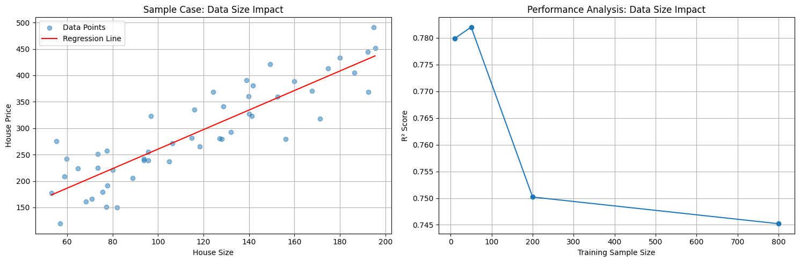
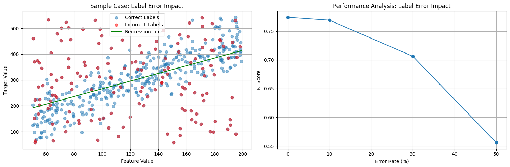
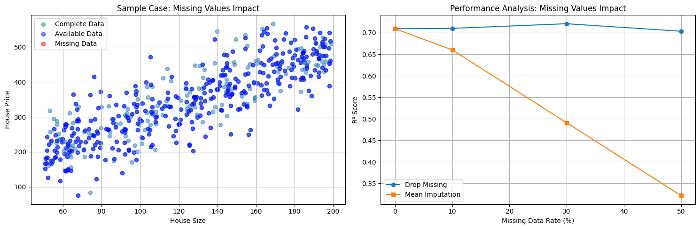
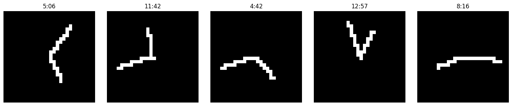

# 資料
+ 如果要訓練出具備普適化的模型，那麼資料的重要性非常的大，若資料存在很大的不確定性(充滿雜訊)，或是任務本身是離散，缺乏連續變化關係，那麼深度學習將無法幫上忙。在收集資料時，有以下幾點重點：
  + **資料量**: 足夠的資料量才能對輸入空間進行密集採樣(特別是 boundary)，有足夠的資料才能讓樣本在流形空間中平滑的內插。就像是考試考超出範圍，學生無法用既有的知識來解題。
  
  + **減少錯誤標示**: 若資料有錯誤的 label，會導致模型的訓練結果不好。就像是老師教錯觀念，學生運用不對的觀念解題導致錯誤。
  
  + **清理資料並處理缺失值**: 若資料本身常出現缺失值，需要透過模型腦補，那也會導致模型訓練結果不好。就像老師教書時，沒有完整的教好觀念，導致學生自行腦補出錯的觀念。
  

# 特徵工程
+ 在訓練模型前，若對資料本身有一定程度的理解，能對資料作一定程度的前處理，可以大大的降低訓練的成本並提升模型的準確度。
+ 以時鐘辨別作為案例，我們產生類似 mnist 的像素圖(10000 * 28 * 28)，並嘗試用不同的特徵來進行 training，來比較模型的成果。

  + 我們可以嘗試使用三種不一樣的特徵來進行 training：
    1. 同 mnist，直接餵入像素圖。(即 shape=(28*28))
    2. 使用時針與分針的卡氏座標。(即 shape=(4))
      + 例 (3.81, 7.48, 6.58, -9.06) 表示 (hr_x, hr_y, min_x, min_y)
    3. 使用時針與分針的極座標。(即 shape=(2))
      + 例 (2.67, 0.63) 表示 (hr_rad, min_rad)
  + 由於我們透過特徵轉換，將原始資料轉換成更有效的資料，便可以增加訓練的效率。
  + CNN 透過 filter 與 max pooling 放大重要的圖形特徵，降維並保留重要的特徵來優化圖像的辨識，讓 model 自動發現關鍵的特徵。但在這個案例中，雖然有效，但浪費。

  # Early Stopping
+ 過度訓練(overfit)是深度學習中最常遇到的問題，避免過度訓練的一個有效方法是 early stopping：
  + **提前終止訓練**: 在驗證集的誤差開始增加時，提前結束訓練過程。就像補習班老師發現學生反覆練習同一類型題目，因為背 pattern 走火入魔前，反而失去靈活的思考，便及時停止練習題目。
  + **實作方式**: 設定 patience 參數，當驗證集誤差連續超過設定次數都沒有改善時，便停止訓練並回傳最佳模型。

    ```python
    callback = tf.keras.callbacks.EarlyStopping(
        monitor='val_loss',       # 監控驗證集損失
        patience=7,              # 容忍多少個 epoch 沒有改善
        min_delta=1e-4,         # 視為改善的最小變化量
        mode='min',             # 監控指標是越小越好
        restore_best_weights=True  # 回存最佳權重
    )

    model.fit(
        x_train, 
        y_train,
        epochs=1000,
        validation_data=(x_val, y_val),
        callbacks=[callback]
    )
    ```

# Regularization
+ 正則化通過對模型權重加入懲罰項，限制模型的複雜度：
  + **L1 正則化**: 添加權重絕對值的懲罰項，傾向產生稀疏的權重矩陣。
  + **L2 正則化**: 添加權重平方的懲罰項，傾向產生較小且分散的權重值。
  + 就像老師要求學生用最簡單的方法解題，避免過度複雜的解法。
  ```python
    # L1 正則化
    regularizer = tf.keras.regularizers.l1(l=0.01)

    # L2 正則化
    regularizer = tf.keras.regularizers.l2(l=0.01)

    model = tf.keras.Sequential([
        tf.keras.layers.Dense(
            units=512,
            kernel_regularizer=regularizer,
            activation='relu'
        )
    ])
  ```

# Dropout
+ Dropout 是一種在訓練時隨機「關閉」一些神經元的技術：
  + **原理**: 每次訓練時隨機讓部分神經元停止工作，迫使網路學習多樣化的特徵表示。
  + **效果**: 相當於訓練多個不同的子網路並進行集成，減少過擬合。
  + 就像是把眾多試題中的部分問題跳過不練習，避免學生學習到「特殊解」反而忘記了「一般解」。
  ```python
    model = tf.keras.Sequential([
        tf.keras.layers.Dense(512, activation='relu'),
        tf.keras.layers.Dropout(0.5),  # 50% 的神經元會被隨機關閉
        tf.keras.layers.Dense(256, activation='relu'),
        tf.keras.layers.Dropout(0.3),  # 30% 的神經元會被隨機關閉
        tf.keras.layers.Dense(10, activation='softmax')
    ])

    model.fit(x_train, y_train, epochs=100)
    model.evaluate(x_test, y_test)
  ```