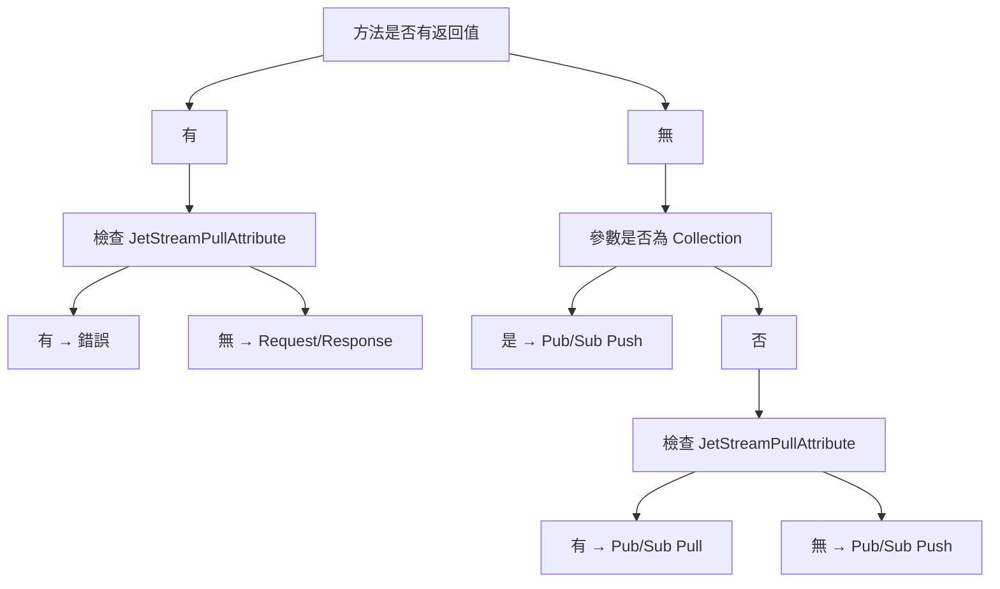
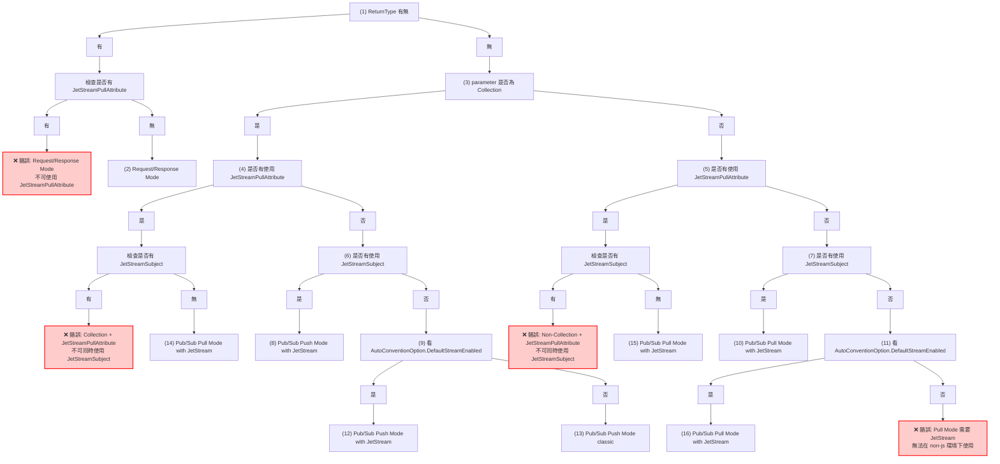

# EdgeSync ServiceFramework AspNetCore.Mvc

## 概覽

EdgeSync ServiceFramework AspNetCore.Mvc 提供了一個強大的框架，用於在 ASP.NET Core 應用程式中自動化 NATS 通訊模式的配置。框架支援兩種主要的通訊模式：**Request/Response** 和 **Pub/Sub**，並可搭配 NATS JetStream 或 Classic NATS 使用。

## 核心架構

### 1. 自動模式決策機制

框架使用 `ConventionDecisionMaker` 根據決策樹自動選擇最適合的通訊模式：



### 2. 支援的通訊模式

| 模式 | 說明 | 使用場景 |
|------|------|----------|
| `RequestResponse` | 請求-回應模式 | API 呼叫、資料查詢 |
| `PubSubPushJetStream` | JetStream Push 模式 | 事件發布、廣播通知 |
| `PubSubPullJetStream` | JetStream Pull 模式 | 工作佇列、批次處理 |
| `PubSubPushClassic` | Classic NATS Push | 輕量級事件通知 |

## Request/Response 實作

### 基本概念

Request/Response 模式適用於需要同步回應的場景，如 API 呼叫、資料查詢等。

### 自動 Convention 方式

```csharp
[ApiController]
[Route("api/[controller]")]
public class BooksController : ControllerBase
{
    private readonly IBookAppService _bookService;

    public BooksController(IBookAppService bookService)
    {
        _bookService = bookService;
    }

    // 自動判斷為 RequestResponse 模式（有返回值）
    [Subject("getBook")]
    public async Task<ErrorOr<BookDto>> GetBookAsync(Guid id)
    {
        return await _bookService.GetAsync(id);
    }

    // HTTP GET 方法，Query 參數綁定
    [Subject("searchBooks")]
    public async Task<ErrorOr<List<BookDto>>> SearchBooksAsync(string keyword, int page = 1)
    {
        return await _bookService.SearchAsync(keyword, page);
    }

    // HTTP POST 方法，Body 參數綁定
    [Subject("createBook")]
    public async Task<ErrorOr<BookDto>> CreateBookAsync([FromBody] CreateBookDto request)
    {
        return await _bookService.CreateAsync(request);
    }
}
```

### HTTP 方法自動對應

框架會根據方法名稱自動決定 HTTP 方法：

- `Get*`, `Find*`, `Search*` → **GET**
- `Create*`, `Add*` → **POST**
- `Update*`, `Modify*` → **PUT**
- `Delete*`, `Remove*` → **DELETE**
- 其他 → **POST**（預設）

### 參數綁定邏輯

- **路由參數**: 如果參數名稱出現在路由模板中，使用 `[FromRoute]`
- **簡單類型**: `int`, `string`, `Guid`, `DateTime` 等使用 `[FromQuery]`
- **複雜類型**: 自定義物件使用 `[FromBody]`

### 手動 ServiceHandler 方式

```csharp
public class BookServiceHandler : ServiceHandler
{
    private readonly IBookAppService _bookAppService;

    public override string ServiceName => "bookstore";
    public override string ServiceVersion => "1.0.0";
    public override string QueueGroup => "bookstore-queue";

    public BookServiceHandler(
        ILogger<BookServiceHandler> logger,
        IJetStreamClientFactory factory,
        IBookAppService bookAppService)
        : base(logger, factory, "bus")
    {
        _bookAppService = bookAppService;
    }

    [Subject("getBook", "bookstore.books.*.get")]
    public async ValueTask GetBookAsync(ServiceMsgContext<string> context, string message)
    {
        try
        {
            var id = context.Subject.Split('.')[2];
            if (!Guid.TryParse(id, out Guid guid))
            {
                var errorResponse = CreateErrorResponse("Invalid request: Id is required");
                await context.ServiceMsg.ReplyAsync(errorResponse);
                return;
            }

            var result = await _bookAppService.GetAsync(guid);
            if (result.IsError)
            {
                var errorResponse = CreateErrorResponse(
                    string.Join(", ", result.Errors.Select(e => e.Description)));
                await context.ServiceMsg.ReplyAsync(errorResponse);
            }
            else
            {
                var successResponse = CreateSuccessResponse(result.Value);
                await context.ServiceMsg.ReplyAsync(successResponse);
            }
        }
        catch (Exception ex)
        {
            Logger.LogError(ex, "Error in GetBookAsync");
            var errorResponse = CreateErrorResponse($"Internal error: {ex.Message}");
            await context.ServiceMsg.ReplyAsync(errorResponse);
        }
    }

    private string CreateSuccessResponse(object data)
    {
        var response = new NatsResponse<object>
        {
            IsSuccess = true,
            Data = data,
            Error = null
        };
        return JsonSerializer.Serialize(response);
    }

    private string CreateErrorResponse(string error)
    {
        var response = new NatsResponse<object>
        {
            IsSuccess = false,
            Data = null,
            Error = error
        };
        return JsonSerializer.Serialize(response);
    }
}
```

## Pub/Sub 實作

### 基本概念

Pub/Sub 模式適用於事件驅動的架構，支援以下子模式：

1. **Push Mode**: 訊息主動推送給訂閱者
2. **Pull Mode**: 訂閱者主動拉取訊息
3. **JetStream**: 提供持久化、重播、確認機制
4. **Classic**: 輕量級、無持久化

### Push Mode（事件發布）

#### 自動 Convention 方式

```csharp
[ApiController]
[Route("api/[controller]")]
public class EventsController : ControllerBase
{
    // 無返回值 → 自動判斷為 PubSub Push 模式
    [Subject("bookRefill")]
    [JetStream(enable: true)] // 明確啟用 JetStream
    public async Task PublishBookRefillAsync([FromBody] BookRefillEvent refillEvent)
    {
        // 發布事件邏輯
        await _eventPublisher.PublishAsync("bookstore.events.book.refill", refillEvent);
    }

    // Collection 參數 → 自動判斷為 PubSub Push 模式
    [Subject("batchProcessBooks")]
    public async Task ProcessBooksAsync([FromBody] List<BookDto> books)
    {
        // 批次處理邏輯
        foreach (var book in books)
        {
            await _bookProcessor.ProcessAsync(book);
        }
    }
}
```

#### 手動 ServiceHandler 方式

```csharp
public class BookEventHandler : NatsService
{
    private readonly IBookAppService _bookService;

    public BookEventHandler(ILogger<BookEventHandler> logger, IBookAppService bookService)
        : base(logger)
    {
        _bookService = bookService;
    }

    // Push 模式：接收事件並處理
    [Subject("handleBookRefill", "bookstore.events.book.refill")]
    public async Task HandleBookRefillAsync(BookRefillEvent refillEvent)
    {
        Logger.LogInformation("Received book refill event for BookId: {BookId}", refillEvent.BookId);
        
        var result = await _bookService.RefillStockAsync(refillEvent.BookId, refillEvent.RefillQuantity);
        
        if (result.IsError)
        {
            Logger.LogError("Failed to process refill event: {Errors}", 
                string.Join(", ", result.Errors.Select(e => e.Description)));
        }
    }
}
```

### Pull Mode（工作佇列）

#### 自動 Convention 方式

```csharp
[ApiController]
[Route("api/[controller]")]
public class WorkersController : ControllerBase
{
    // 使用 JetStreamPullAttribute → 自動判斷為 Pull 模式
    [Subject("processBookOrders")]
    [JetStreamPull(
        consumerName: "book-order-processor",
        consumerGroup: "order-workers",
        maxMessages: 10,
        ackPolicy: "Explicit")]
    public async Task ProcessBookOrdersAsync([FromBody] BookOrderTask task)
    {
        // 處理單個訂單任務
        await _orderProcessor.ProcessAsync(task);
    }

    // Collection + JetStreamPull → 批次拉取處理
    [Subject("processBatchOrders")]
    [JetStreamPull(
        consumerName: "batch-order-processor",
        maxMessages: 50)]
    public async Task ProcessBatchOrdersAsync([FromBody] List<BookOrderTask> tasks)
    {
        // 批次處理訂單
        await Task.WhenAll(tasks.Select(_orderProcessor.ProcessAsync));
    }
}
```

#### 手動 BaseEventHandler 方式

```csharp
public class BookOrderProcessor : BaseEventHandler
{
    private readonly IOrderService _orderService;

    public BookOrderProcessor(
        ILogger<BaseEventHandler> logger,
        IJetStreamClientFactory factory,
        IOrderService orderService)
        : base(logger, factory, "broker")
    {
        _orderService = orderService;
    }

    protected override string SubjectName => "bookstore.orders.process";
    protected override string StreamName => "bookstore-orders";
    protected override string ConsumerName => "order-processor";

    // JetStream 配置
    protected override JetStreamConfigOptions JStreamCfgOpts { get; set; } = new()
    {
        MaxMsgs = -1,
        MaxBytes = -1,
        MaxAge = TimeSpan.FromDays(7),
        Description = "Book order processing stream",
        Retention = StreamConfigRetention.Limits,
        Storage = StreamConfigStorage.File,
    };

    // Consumer 配置
    protected override ConsumerConfigOptions ConsumerCfgOpts { get; set; } = new()
    {
        AckPolicy = ConsumerConfigAckPolicy.Explicit,
        ReplayPolicy = ConsumerConfigReplayPolicy.Instant,
        MaxAckPending = 100,
    };

    protected override async Task HandleInputEventCore(byte[] message, string subject)
    {
        try
        {
            var messageJson = Encoding.UTF8.GetString(message);
            var orderTask = JsonSerializer.Deserialize<BookOrderTask>(messageJson);

            if (orderTask == null)
            {
                Logger.LogWarning("Failed to deserialize order task from subject: {Subject}", subject);
                return;
            }

            Logger.LogInformation("Processing order task: {OrderId}", orderTask.OrderId);
            
            var result = await _orderService.ProcessOrderAsync(orderTask);
            
            if (result.IsError)
            {
                Logger.LogError("Failed to process order {OrderId}: {Errors}",
                    orderTask.OrderId, string.Join(", ", result.Errors.Select(e => e.Description)));
                // 可以選擇重新排隊或發送到 DLQ
                return;
            }

            Logger.LogInformation("Successfully processed order: {OrderId}", orderTask.OrderId);
        }
        catch (Exception ex)
        {
            Logger.LogError(ex, "Unexpected error processing order from subject: {Subject}", subject);
        }
    }
}
```

## 模式配置與屬性

### Subject 屬性

```csharp
[Subject("endpointName", "custom.subject.pattern")]
public async Task MethodAsync(...)
```

- `endpointName`: API 端點名稱
- `customSubject`: 自定義 NATS subject 模式

### JetStream 屬性

```csharp
[JetStream(enable: true)]  // 明確啟用 JetStream
[JetStream(enable: false)] // 明確禁用 JetStream（使用 Classic NATS）
```

### JetStream Pull 屬性

```csharp
[JetStreamPull(
    consumerName: "my-consumer",
    consumerGroup: "worker-group",
    maxMessages: 10,
    ackPolicy: "Explicit",
    createConsumerIfNotExists: true)]
```

### 參數綁定屬性

```csharp
public async Task MethodAsync(
    [FromRoute] Guid id,           // 路由參數
    [FromQuery] string filter,     // 查詢參數
    [FromBody] CreateDto request)  // 請求本體
```

## 配置選項

### AutoConventionOptions

```csharp
services.Configure<AutoConventionOptions>(options =>
{
    options.DefaultJetStreamEnable = true;  // 預設啟用 JetStream
    options.RequestTimeout = TimeSpan.FromSeconds(30);
    options.RetryCount = 3;
    options.ErrorHandlingMode = "Detailed";
});
```

### 服務註冊

```csharp
public void ConfigureServices(IServiceCollection services)
{
    // 註冊 ServiceFramework
    services.AddServiceFramework(options =>
    {
        options.NatsUrl = "nats://localhost:4222";
        options.DefaultJetStreamEnable = true;
    });

    // 註冊 Auto Convention
    services.AddAutoConvention(options =>
    {
        options.EnableAutoRouting = true;
        options.RoutePrefix = "api/nats";
    });

    // 註冊應用服務
    services.AddScoped<IBookAppService, BookAppService>();
    
    // 註冊 ServiceHandler（手動模式）
    services.AddHostedService<BookServiceHandler>();
    services.AddHostedService<BookEventHandler>();
}
```

## 背景服務機制

### ServiceFrameworkBackgroundService

框架會自動掃描並啟動所有繼承自 `NatsService` 的服務：

```csharp
public class ServiceFrameworkBackgroundService : BackgroundService
{
    protected override async Task ExecuteAsync(CancellationToken stoppingToken)
    {
        // 1. 掃描所有 NatsService 實作
        var serviceTypes = AppDomain.CurrentDomain.GetAssemblies()
            .SelectMany(assembly => assembly.GetTypes())
            .Where(type => type.IsClass && !type.IsAbstract &&
                           type.IsSubclassOf(typeof(NatsService)))
            .ToList();

        // 2. 為每個服務建立 NATS 連線
        foreach (var serviceType in serviceTypes)
        {
            var channelAttribute = serviceType.GetCustomAttribute<ChannelAttribute>();
            var connection = channelAttribute?.Name != null
                ? scope.ServiceProvider.GetRequiredKeyedService<INatsConnection>(channelAttribute.Name)
                : scope.ServiceProvider.GetRequiredService<INatsConnection>();

            // 3. 註冊方法端點並開始監聽
            var natsMethods = service.GetNatsMethods();
            foreach (var natsMethod in natsMethods)
            {
                await SubscribeToMethod(connection, serviceType, natsMethod, stoppingToken);
            }
        }
    }
}
```

## 錯誤處理與回應

### ErrorOr 結果處理

```csharp
public async Task HandleMessage(NatsMethodInfo methodInfo, NatsMsg<string> msg)
{
    var result = methodInfo.Method.Invoke(service, args);
    
    if (result is Task task && task.GetType().IsGenericType)
    {
        var taskResult = task.GetType().GetProperty("Result")?.GetValue(task);
        
        if (IsErrorOrType(taskResult.GetType()))
        {
            var response = CreateNatsResponse(taskResult);
            await msg.ReplyAsync(JsonSerializer.Serialize(response));
        }
    }
}

private object CreateNatsResponse(object errorOrResult)
{
    var isError = (bool)errorOrResult.GetType().GetProperty("IsError")!.GetValue(errorOrResult)!;
    
    if (isError)
    {
        var errors = errorOrResult.GetType().GetProperty("Errors")!.GetValue(errorOrResult) as IEnumerable<Error>;
        return new NatsResponse<object>
        {
            IsSuccess = false,
            Data = null,
            Error = errors?.FirstOrDefault()?.Description ?? "Unknown error"
        };
    }
    else
    {
        var value = errorOrResult.GetType().GetProperty("Value")!.GetValue(errorOrResult);
        return new NatsResponse<object>
        {
            IsSuccess = true,
            Data = value,
            Error = null
        };
    }
}
```

## 總結

EdgeSync ServiceFramework 提供了兩種主要的實作方式：

1. **Auto Convention 模式**: 適合快速開發，框架自動決定通訊模式和配置
2. **手動 ServiceHandler 模式**: 提供更細緻的控制，適合複雜的業務邏輯

選擇使用哪種方式取決於您的具體需求：
- 簡單的 CRUD 操作建議使用 Auto Convention
- 複雜的事件處理和工作流程建議使用手動 ServiceHandler
- 兩種方式可以在同一個應用程式中混合使用

框架的設計讓開發者可以專注於業務邏輯，而無需擔心底層的 NATS 通訊細節。 


### Auto-Convention Decision Tree


